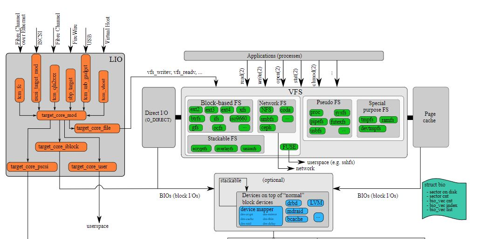
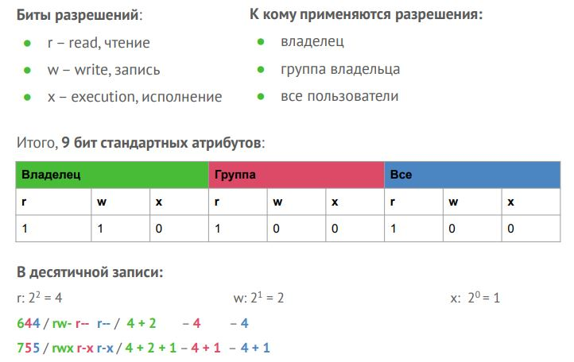
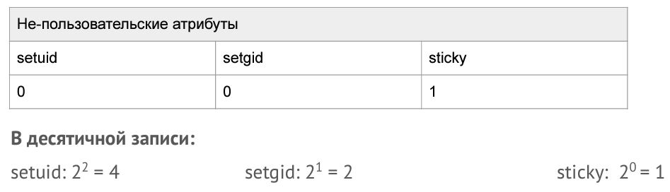
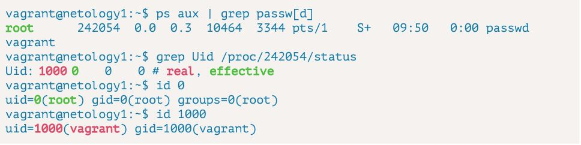
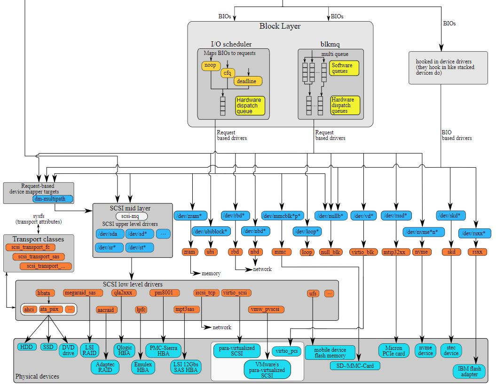
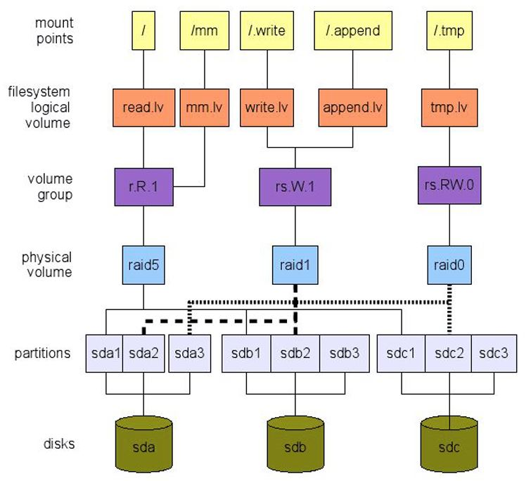

## Файловые системы

[__Схема целиком__](https://upload.wikimedia.org/wikipedia/commons/f/fb/The_Linux_Storage_Stack_Diagram.svg)

Верхняя часть, которую и обсудим ниже:


На картинке, всё, что находится выше Applications (process) и включая - это `user space`.\
Всё что ниже - `kernel space`.

Стрелочки, подписанные `read(2)`, `write(2)`, `stat(2)` и т.д. это системные вызовы, инфу по ним можно посмотреть во 2-м разделе `man`.

Из схемы видно, что приложения взаимодействуют с VFS - это такая подсистема ядра, которая реализует интерфейс взаимодействия пользовательских
приложений с различными файловыми системами. Более того, она позволяет добавлять поддержку новых FS в ядро.

Linux поддерживает порядка 50 файловых систем.

На картинке:
- `Block-based FS` - эти FS используют блочные устройства для хранения данных;
- `Network FS` - сетевые FS, т.е. с ними мы работаем, как с фалами, но все наши вызовы транслируются по сети на удалённые хранилища;
- `Pseudo FS` - это, например, /proc, которая FS не является, там данные не хранятся, там реализован интерфейс доступа к данным из ядра;
- `Special purpuse` - эти FS тоже не используют внешние носители, а хранят все данные в памяти;


### Объекты файловой системы

#### Подробная информация о файле: `man 2 stat, /stat \{`
Посмотрим на системный вызов `stat`, который мы видели на схеме. Он используется для получения данных о файле.
Информацию о нём можно посмотреть в man: `man 2 stat`.

> Помним, что: `sudo apt-get install manpages-dev` - установка полной версии `man`, включая 2-й раздел.


`man 2 stat`:
```sh
struct stat {
	dev_t     st_dev;         /* ID устройства, содержащего файл */
	ino_t     st_ino;         /* номер Inode */
	mode_t    st_mode;        /* биты доступа + тип файла */
	nlink_t   st_nlink;       /* число hard links (жестких ссылок) */
	uid_t     st_uid;         /* User ID – принадлежность пользователю */
	gid_t     st_gid;         /* Group ID – принадлежность группе */
	dev_t     st_rdev; /* Device ID – тип устройства, если файл является файлом специального назначения */
	off_t     st_size;        /* Размер в байтах */
	struct timespec st_atim;  /* Время последнего доступа */
	struct timespec st_mtim;  /* Время последнего изменения содержимого */
	struct timespec st_ctim;  /* Время последнего изменения метаданных */
```

Так же есть одноимённая утилита `stat`, которая использует этот вызов и выводит в консоль те же данные, но в читаемом виде.\
Эта утилита входит в пакет [GNU Core Utilities](https://ru.wikipedia.org/wiki/GNU_Coreutils) и установлена в ОС по умолчанию.\
Пример:
```sh
vagrant@vagrant:~$ stat /etc/hosts
  File: /etc/hosts
  Size: 222             Blocks: 8          IO Block: 4096   regular file
Device: fd00h/64768d    Inode: 262844      Links: 1
Access: (0644/-rw-r--r--)  Uid: (    0/    root)   Gid: (    0/    root)
Access: 2022-03-16 14:13:47.340703817 +0000
Modify: 2021-12-19 19:39:18.555684984 +0000
Change: 2021-12-19 19:39:18.555684984 +0000
 Birth: -
```
Где:
- Size: 222 - размер файла в байтах;
- Blocks: 8 - количество блоков, которые занимает файл на HDD. 1 блок = 512 байт;
- IO Block: 4096 - размер блока файловой системы в кб. Задаётся при создании файловой системы;
- regular file - тип файла (в данном случай он обычный);
- Inode: 262844 - индексный дескриптор для этого файла, но об этом позже;
- Links: 1 - количество hard линков.
- (0644/-rw-r--r--) - права доступа;
- Uid:(0/root) - владелец файла;
- Gid:(0/root) - группа владельца файла;
- Access: 2022-03-16 14:13:47.340703817 +0000 - время доступа к файлу;
- Modify: 2021-12-19 19:39:18.555684984 +0000 - время изменения данных файла;
- Change: 2021-12-19 19:39:18.555684984 +0000 - время изменения метаданных файла;
- Birth: - время создания файла;

Даже при малом размере файла в 222 байта на устройстве выделено 8 блоков по 512 байт (так как минимальный блок ФС – 4096 байт)

#### `Inodе` или `index node` - индексный дескриптор файла.

inode - это область данных в файловой системе. Она хранит различные метаданные файла и указали на участки диска,
где хранятся сами данные, находящиеся внутри файла.

Индексый дескриптор имеет номер и в нашем примере `Inode = 262844`. Они хранятся отдельно в файловой системе в таблице
индексных дескрипторов и каждый имеет уникальное значение в пределах этой файловой системы.
Там же хранятся и указатели, о которых упоминалось выше.

Что же такое hard link?

[__Жесткие и символические ссылки__](https://losst.ru/simvolicheskie-i-zhestkie-ssylki-linux)

Имя файла не является основным идентификатором, которым оперирует ОС. Основным идентификаторм является номер индексного дескриптора и именно по этой причине он является уникальным.

>Получается, что в FS может существовать несколько файлов, которые ссылаются на один и тот же номер индексного дескриптора!

Пример:
```sh
vagrant@vagrant:~/tmp$ touch file1.txt
vagrant@vagrant:~/tmp$ echo "Hello worldZ!" > file1.txt
vagrant@vagrant:~/tmp$ cat file1.txt
Hello worldZ!
vagrant@vagrant:~/tmp$ ln file1.txt file2.txt
vagrant@vagrant:~/tmp$ ls -alh
total 16K
drwxrwxr-x 2 vagrant vagrant 4.0K Mar 19 20:34 .
drwxr-xr-x 5 vagrant vagrant 4.0K Mar 19 19:55 ..
-rw-rw-r-- 2 vagrant vagrant   14 Mar 19 19:56 file1.txt
-rw-rw-r-- 2 vagrant vagrant   14 Mar 19 19:56 file2.txt
vagrant@vagrant:~/tmp$ stat file1.txt
  File: file1.txt
  Size: 14              Blocks: 8          IO Block: 4096   regular file
Device: fd00h/64768d    Inode: 1048600     Links: 2
Access: (0664/-rw-rw-r--)  Uid: ( 1000/ vagrant)   Gid: ( 1000/ vagrant)
Access: 2022-03-19 19:56:28.726622427 +0000
Modify: 2022-03-19 19:56:22.967744427 +0000
Change: 2022-03-19 20:34:37.574474391 +0000
 Birth: -
vagrant@vagrant:~/tmp$ stat file2.txt
  File: file2.txt
  Size: 14              Blocks: 8          IO Block: 4096   regular file
Device: fd00h/64768d    Inode: 1048600     Links: 2
Access: (0664/-rw-rw-r--)  Uid: ( 1000/ vagrant)   Gid: ( 1000/ vagrant)
Access: 2022-03-19 19:56:28.726622427 +0000
Modify: 2022-03-19 19:56:22.967744427 +0000
Change: 2022-03-19 20:34:37.574474391 +0000
 Birth: - 
```

В приведённом выше примере можно увидеть, что вроде как разные файлы на самом деле ссылаются на один и тот же
индексный дескриптор, а значит на одну и ту же область, в которой хранится содержимое файла.

Как посмотреть все hard-линки на файл? Для этого надо вести поиск по значению `inode`

Пример:
```sh
vagrant@vagrant:~/tmp$ find -inum 1048600
./file1.txt
./file2.txt
```
С точки зрения ОС эти 2 файла являются равнозначными.
Это значит, в том числе и то, что удаление одного из них не освободит место в файловой системе т.к. второй продолжает существовать.

>Получается, что для удаления файла необходимо удалить все hard-линки на него.

Команда `find <путь> -type f -printf '%n %p\n'` ищет и выводит список файлов указывая количество hard-линков и их имена. 

#### `Inodе` и имена файлов

Как мы уже знаем, файловая система оперирует номерами `inode`.\
Директория - это особый вид файла в файловой системе.\
Директории содержат в себе список файлов, находящихся в них и номера `inode` этих файлов.

Число `inode` определяет число объектов, которое может быть создано в файловой системе.

>Есть файловые системы, где `inode` предварительно выделяются при создании (семейство `ext`);
>есть те, где `inode` может быть добавлены динамически (`xfs`). Об этом важно знать, так как может сложиться ситуация,
>при которой в файловой системе есть свободное пространство для создания файлов, но уже нет доступных `inode`.

Одна из встречающихся техник программирования в Linux – изменения поведения
программы в зависимости от того, под каким именем ее вызвали.

Пример из лекции:
```sh
root@netology1:~# ls -li /usr/bin/bzip2
3407895 -rwxr-xr-x 3 root root 39144 Sep 5 2019 /usr/bin/bzip2
root@netology1:~# find /usr/bin -inum 3407895
/usr/bin/bunzip2
/usr/bin/bzip2
/usr/bin/bzcat
```

#### dentry (directory entry), директории

Директории, как уже упоминалось, это особый вид файлов.\
Директории содержат в себе список файлов, находящихся в них и номера `inode` этих файлов.

Такая структура называется `dentry`, что расшифровывается, как `directory entry` и когда мы просматриваем содержимое директорий
с помощью команды `ls`, происходит системный вызов __`getdents64`__ (пример из лекции):
```sh
root@netology1:~# strace -e getdents64 ls
getdents64(3, /* 4 entries */, 32768) = 112
```

Цитата лектора:\
*"У любой директории есть короткая ссылка - это точка `"."`, есть две точки `".."` - это жёсткая ссылка на директорию выше текущей.
Точка это тоже по сути файл, который является жёсткой ссылкой на текущую директорию"*

Пример:
```sh
vagrant@vagrant:~$ stat tmp/
  File: tmp/
  Size: 4096            Blocks: 8          IO Block: 4096   directory
Device: fd00h/64768d    Inode: 1048598     Links: 2
Access: (0775/drwxrwxr-x)  Uid: ( 1000/ vagrant)   Gid: ( 1000/ vagrant)
Access: 2022-03-19 20:34:46.342856394 +0000
Modify: 2022-03-19 20:34:37.574474391 +0000
Change: 2022-03-19 20:34:37.574474391 +0000
 Birth: -
 vagrant@vagrant:~/tmp$ stat .
  File: .
  Size: 4096            Blocks: 8          IO Block: 4096   directory
Device: fd00h/64768d    Inode: 1048598     Links: 2
Access: (0775/drwxrwxr-x)  Uid: ( 1000/ vagrant)   Gid: ( 1000/ vagrant)
Access: 2022-03-19 20:34:46.342856394 +0000
Modify: 2022-03-19 20:34:37.574474391 +0000
Change: 2022-03-19 20:34:37.574474391 +0000
 Birth: -
```

Сравниваем значения `Inode` в примере вывода команд выше. Они одинаковые.

Именно по этому у директорий __всегда__ более чем одна жёсткая ссылка.

#### Типы файлов: `man 2 stat, /S_IFMT`

```sh
 case S_IFREG: printf("regular file\n"); break;
 case S_IFDIR: printf("directory\n"); break;
 case S_IFLNK: printf("symlink\n"); break;
 case S_IFIFO: printf("FIFO/pipe\n"); break;
 case S_IFSOCK: printf("socket\n"); break;
 case S_IFBLK: printf("block device\n"); break;
 case S_IFCHR: printf("character device\n"); break;
```

В `man` по системному вызову `stat` описаны типы файлов, которые встречаются в Linux:
- __regular file__, стандартный файл;
- __directory__, директория;
- __symlink__ – родственная жесткой ссылке сущность. Встречаются названия мягкая
ссылка или симлинк. В отличие от hardlink, – symlink это полноценный объект в
файловой системе, который, в частности, может переходить за ее границы и ссылаться
на объекты других файловых систем. Не увеличивает счетчик ссылок Links и не влияет на
сохранность адреса ссылки (аналогия с ярлыком Windows) при удалении;
- __pipe__ – мы с вами уже встречались с пайпами, `"|"`, это неименованные или анонимные пайпы. 

Создадим себе симлинк с относительными путями:
```sh
vagrant@vagrant:~$ ln -s tmp/file1.txt sfile1
vagrant@vagrant:~$ ls -alh
total 44K
drwxr-xr-x 5 vagrant vagrant 4.0K Mar 21 19:39 .
drwxr-xr-x 3 root    root    4.0K Dec 19 19:42 ..
...
lrwxrwxrwx 1 vagrant vagrant   13 Mar 21 19:39 sfile1 -> tmp/file1.txt
...
vagrant@vagrant:~$
```
Убедимся, что значения `inode` у них различны:
```sh
vagrant@vagrant:~$ stat sfile1
  File: sfile1 -> tmp/file1.txt
  Size: 13              Blocks: 0          IO Block: 4096   symbolic link
Device: fd00h/64768d    Inode: 1048606     Links: 1
Access: (0777/lrwxrwxrwx)  Uid: ( 1000/ vagrant)   Gid: ( 1000/ vagrant)
Access: 2022-03-21 19:39:39.141533534 +0000
Modify: 2022-03-21 19:39:22.241087535 +0000
Change: 2022-03-21 19:39:22.241087535 +0000
 Birth: -
vagrant@vagrant:~$ stat tmp/file1.txt
  File: tmp/file1.txt
  Size: 14              Blocks: 8          IO Block: 4096   regular file
Device: fd00h/64768d    Inode: 1048600     Links: 2
Access: (0664/-rw-rw-r--)  Uid: ( 1000/ vagrant)   Gid: ( 1000/ vagrant)
Access: 2022-03-19 19:56:28.726622427 +0000
Modify: 2022-03-19 19:56:22.967744427 +0000
Change: 2022-03-19 20:34:37.574474391 +0000
 Birth: -
```

Симлинк с абсолютными путями:
```sh
vagrant@vagrant:~$ ln -s /home/vagrant/tmp/file1.txt sfile2
vagrant@vagrant:~$ ls -alh
total 44K
drwxr-xr-x 5 vagrant vagrant 4.0K Mar 21 19:46 .
drwxr-xr-x 3 root    root    4.0K Dec 19 19:42 ..
...
lrwxrwxrwx 1 vagrant vagrant   13 Mar 21 19:39 sfile1 -> tmp/file1.txt
lrwxrwxrwx 1 vagrant vagrant   27 Mar 21 19:46 sfile2 -> /home/vagrant/tmp/file1.txt
...
```

Теперь поговорим про тип файла __pipe__.

Он предназначен для передачи данных от одного процесса к другому.
Под процессом тут можно понимать не только скрипт или утилиту, запущенную в терминале,
но и любую программу, `daemon`, работающую в ОС.

С помощью  команды `mkfifo` можно создать именованный pipe. Фактически это файл, но для наглядности
проще представить себе __именованную__ трубу, в один конец которой какая угодно программа может заливать
данные, а с другоко конца этой трубы, любая программа может их получать.

Пример:
```sh
vagrant@vagrant:~/tmp$ mkfifo test_pipe
vagrant@vagrant:~/tmp$ ls -l
total 8
-rw-rw-r-- 2 vagrant vagrant 14 Mar 19 19:56 file1.txt
-rw-rw-r-- 2 vagrant vagrant 14 Mar 19 19:56 file2.txt
prw-rw-r-- 1 vagrant vagrant  0 Mar 21 19:56 test_pipe
vagrant@vagrant:~/tmp$ echo "Hello world!" > test_pipe &
[1] 2304
vagrant@vagrant:~/tmp$ cat test_pipe
Hello world!
[1]+  Done                    echo "Hello world!" > test_pipe
vagrant@vagrant:~/tmp$
```
> Обратить внимание, что при выводе `ls -l` в правах доступа к `pipe` есть символ __p__ : `prw-rw-r--`

Терминал используется в данном случае для наглядности.

>Вообще, когда мы в терминале используем пайпы типа: `sh ps aux | grep 'tests' | grep 'test1'`, 
>то эти пайпы система создаёт анонимными и используются они только для работы в терминале.


#### Тип файлов socket

__socket__ – бывает сетевым, для соединения удаленных хостов и локальным, для
соединения в рамках одного хоста. Сетевые рассмотрим в следующих лекциях.
Локальные (доменные) сокеты – еще один тип межпроцессного взаимодействия (в
дополнение к уже известным нам именованным и неименованным пайпам, сигналам
и разделяемой памяти процессов). Если в сетевых для подключения сокета
используется сетевой адрес+порт, в доменном сокете данным адресом является путь
на файловой системе.
Плюсы перед `pipe`:
- сокеты могут быть двунаправленными, тогда как `pipe` – однонаправленные,
- производительнее,
- много клиентов может писать в один `pipe`, однако сторона-приемник не может
узнать, кто записал в `pipe`, в `socket` такой проблемы нет.


### Права доступа

#### Стандартные права доступа



#### Стандартные права доступа: применимость

Для файлов:
- read для просмотра содержимого файлов;
- write для изменения содержимого файлов;
- execute для запуска файла в качестве программы\процесса.

Для директорий:
- read для просмотра содержимого директории (ls);
- write для создания или удаления объектов из директории;
- execute для chdir в директорию.

#### Изменение владельца

Команда `chown` или __change owner__, предназначена для изменения владельца/группы файла.

Пример из лекции:
```sh
root@netology1:/tmp# touch file
root@netology1:/tmp# chown vagrant file
root@netology1:/tmp# stat file | grep Uid
Access: (0644/-rw-r--r--) Uid: ( 1000/ vagrant) Gid: ( 0/ root)
```
С одинарным аргументом – меняет пользователя.

С аргументом вида `:group` – меняет группу.

Пример из лекции:
```sh
root@netology1:/tmp# chown :vagrant file
root@netology1:/tmp# stat file | grep Uid
Access: (0644/-rw-r--r--) Uid: ( 1000/ vagrant) Gid: ( 1000/ vagrant)
```
При вызове вида `user:`, изменит и пользователя и группу (равнозначно `user:user)`

Пример из лекции:
```sh
root@netology1:/tmp# touch file2
root@netology1:/tmp# chown vagrant: file2
root@netology1:/tmp# stat file2 | grep Uid
Access: (0644/-rw-r--r--) Uid: ( 1000/ vagrant) Gid: ( 1000/ vagrant)
```

#### Изменение прав доступа

Команда `chmod` или __change mode__, предназначена для изменения битов разрешений доступа.

С десятичной записью полных прав: `chmod 0755 file`, или с буквенной записью: `chmod u=rwx,g=rx,o=rx file`.

Можно добавлять `(+)` или убирать `(-)` относительно имеющихся.

Пример из лекции:
```sh
root@netology1:/tmp# stat file | grep Uid
Access: (0755/-rwxr-xr-x) Uid: ( 1000/ vagrant) Gid: ( 1000/ vagrant)
root@netology1:/tmp# chmod a-x file
root@netology1:/tmp# stat file | grep Uid
Access: (0644/-rw-r--r--) Uid: ( 1000/ vagrant) Gid: ( 1000/ vagrant)
```

#### Пользовательская маска: umask - user mask

Утилита `umask`, маска, определяет, какие права доступа будут у вновь созданных файлов пользователя.

Как это происходит?\
Для директорий штатные права ОС – 0777, для файлов – 0666. Тем не менее,
применяя `mkdir` или `touch`, вы увидите (пример из лекции):
```sh
vagrant@netology1:~$ mkdir dir; touch file
vagrant@netology1:~$ stat {dir,file} | grep Uid
Access: (0775/drwxrwxr-x) Uid: ( 1000/ vagrant) Gid: ( 1000/
vagrant)
Access: (0664/-rw-rw-r--) Uid: ( 1000/ vagrant) Gid: ( 1000/
vagrant)
```
Как получились такие права доступа: 0775 и 0664 ?\
Всё просто: из прав доступа *по-умолчанию* вычитается `umask`, маска: 0777-0002=0775, 0666-0002=0664
Почему вычитается 0002?\
Потому что так задано значение `umask` для __обычного__ пользователя:
```sh
vagrant@vagrant:~$ umask
0002
```
Для __привилегированного__ пользоваться значение `umask` 0022:
```sh
vagrant@vagrant:~$ sudo -i
root@vagrant:~# umask
0022
```

Значение `umask` задаётся в одном из скриптов конфигурации ОС и инициализируется при загрузке.

#### Дополнительные права доступа

Полное поле атрибутов файла – 12 бит.\
Перед 9 битами пользовательских разрешений есть еще три:
- setuid;
- setgid;
- sticky.

Логика установки такая же, как с __rwx__:

```sh
vagrant@vagrant:~$ stat /tmp | grep Uid
Access: (1777/drwxrwxrwt)  Uid: (    0/    root)   Gid: (    0/    root)
```
Вместо 0777 мы видим __1__777 - это используется так называемый __sticky__ бит, о котором чуть ниже.

#### Дополнительные права доступа: применимость

__sticky__ бит используется для директорий, в которые доступна запись многим пользователям, но требуется защитить файлы от чужого вмешательства.
Т.е. многие пользователи могут зайти в директорию, но удалить\изменить могут только свои файлы.\
Пример такой директории может быть `tmp/` - директория, куда многие программы пишут свои временные файлы. Очевидно, что можифицировать или удалять
эти программы должны только принадлежащие им файлы.

Теперь о __setuid__ / __setgid __. У этих аттрибутов одинаковый механизм работы, кроме применимости к пользователю (_U_) или группе (_G_).

Обычно в линуксе при запуске программы пользователь получает процесс, который наследует права доступа этого самого пользователя и его группы.
В некоторых случаях запускаемым программам нужны расширенные права - именно для них и нужны биты __setuid__ / __setgid __, которые меняют 
поведение по умолчанию и при запуске программ с этими аттрибутами порождается процесс, наследующий аттрибуты самого файла программы.

Обычно биты __setuid__ / __setgid __ можно встретить на *исполняемых* файлах. Пользователь, запускающий такой файл, получает __процесс__,
работающий с __правами владельца__ исполняемого файла, а не с правами запустившего его пользователя.

Классическим примером может служить вызов утилиты смены пароля `passwd`, где владелец и группа - `root`.\
Каждый пользователь должен иметь возможность сменить пароль. Вот тут и возникает вопрос доступа к этим файлам, "закрытым" от обычного пользователя.

> Запустить с использованием `tmux` или `screen` т.к. из команды в следующем примере выхода не нашёл.

```sh
vagrant@vagrant:~$ stat $(which passwd) | grep Uid
Access: (4755/-rwsr-xr-x)  Uid: (    0/    root)   Gid: (    0/    root)
...
```
__4__ 755/-rw __s__ r-xr-x

Утилита `passwd` должна иметь доступ к закрытым файлам, к которым имеет доступ только `root`:
```sh
vagrant@vagrant:~$ ll /etc/pass*
-rw-r--r-- 1 root root 1875 Dec 19 19:45 /etc/passwd
vagrant@vagrant:~$ ll /etc/shad*
-rw-r----- 1 root shadow 1068 Dec 19 19:45 /etc/shadow
```
`passwd` требуется обновить файл `/etc/shadow`, в котором хранятся хеши паролей. Этот файл доступен на запись только root.

Пример из лекции:
```sh
vagrant@netology1:~$ stat /etc/passwd | grep Uid
Access: (0644/-rw-r--r--)  Uid: (    0/    root)   Gid: (    0/    root)
```
`suid`-бит на исполняемом файле `passwd` дает возможность запустить его с “эффективными” правами root даже обычному пользователю.

Пример из лекции:


Этот же пример показывает опасность некорректного употребления `suid/guid`: если бы в `passwd` не было дополнительных проверок, любой пользователь
мог бы поменять пароль root, чего, конечно же, сделать нельзя.
```sh
vagrant@vagrant:~$ passwd root
passwd: You may not view or modify password information for root.
```

`setgid` работает с группами на директориях и имеет другой эффект (`setuid` обычно не используется).
С этим установленным битом вновь создаваемые файлы и директории наследуют группу владельца родительского каталога, а не пользователя, инициировавшего операцию.

Пример из лекции:
```sh
vagrant@netology1:~$ mkdir test_dir
vagrant@netology1:~$ sudo chown :tcpdump test_dir
vagrant@netology1:~$ stat test_dir/ | grep Gid
Access: (0775/drwxrwxr-x)  Uid: ( 1000/ vagrant)   Gid: (65534/ nogroup)
```

__Стандартное поведение без setgid__ (пример из лекции):
```sh
vagrant@netology1:~$ mkdir test_dir/no_gid; stat $_ | grep Gid
Access: (0775/drwxrwxr-x)  Uid: ( 1000/ vagrant)   Gid: ( 1000/ vagrant)
```

__Поведение с установленным setgid__ (пример из лекции):
```sh
vagrant@netology1:~$ chmod g+s test_dir/
vagrant@netology1:~$ stat test_dir/ | grep Uid
Access: (2775/drwxrwsr-x)  Uid: ( 1000/ vagrant)   Gid: (  114/ tcpdump)
vagrant@netology1:~$ mkdir test_dir/with_gid; stat $_ | grep Gid
Access: (2775/drwxrwsr-x)  Uid: ( 1000/ vagrant)   Gid: (  114/ tcpdump)
```

#### Дополнительные атрибуты: lsattr/chattr

Помимо стандартных 12 бит для записи разрешений в метаданных файла, могут присутствовать дополнительный атрибуты, способные ввести в затруднение тех, кто о них не знает:
```sh
root@netology1:~# echo 'test' > test_file
-bash: test_file: Operation not permitted
root@netology1:~# stat test_file | grep Uid
Access: (0644/-rw-r--r--)  Uid: (    0/    root)   Gid: (    0/    root)
```
Почему root не может записать данные в файл, которым он владеет и имеет права на запись?

Потому что установлен дополнительный аттрибут:
```sh
root@netology1:~# lsattr test_file
----i---------e----- test_file
```
Установлен флаг `i – immutable`, неизменяемый. Полный список расширенных атрибутов – `man chattr`, `chattr -i` для удаления immutable:
```sh
root@netology1:~# chattr -i test_file
root@netology1:~# echo 'test' > test_file
root@netology1:~# echo $?
0
```

### Организация хранения данных в Linux

[__Схема целиком__](https://upload.wikimedia.org/wikipedia/commons/f/fb/The_Linux_Storage_Stack_Diagram.svg)

Нижняя часть схемы:


Рассмотрим устройства хранения - блочные устройства.

В вехней части был уровень приложений и файловые системы, которые опираются на устройства хранения.

В подсистеме "Block Layer", блок серого цвета вверху этой картинки, есть свой шедулер `I/O scheduler` - смотреть состояние которого можно с помощью утилиты `iostat`.
Все запросы на чтение\запись из "Block Layer" приходят в файлы блочные устройства, которые находятся в диретории `/dev/`. Все эти устройства выглядят, как стандартные
файлы в файловой системе, но имеют тип "устройство" и они привязаны к драйверу реального устройства.


### Схема уровней хранения данных



[__Источник__](https://linuxconfig.org/choosing-the-right-linux-file-system-layout-using-a-top-bottom-process)


