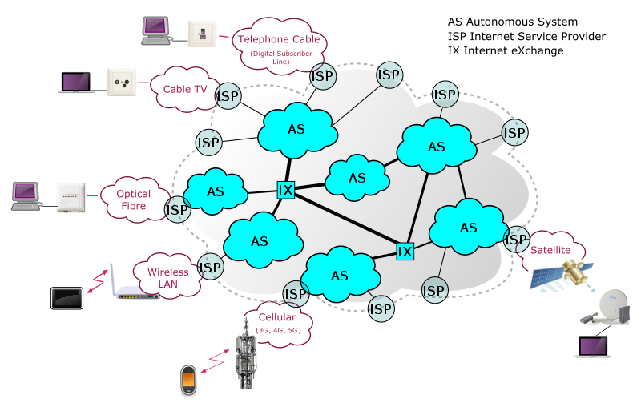
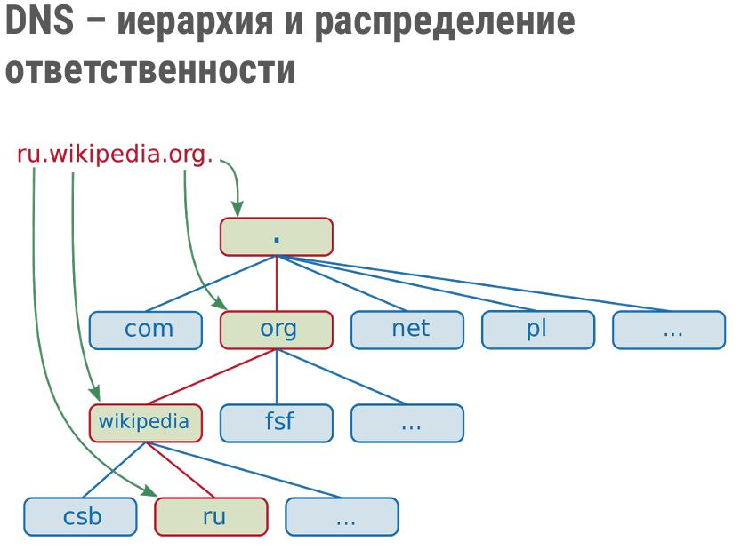
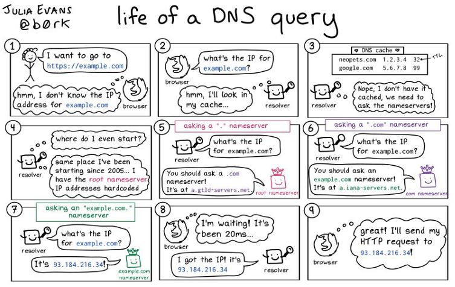
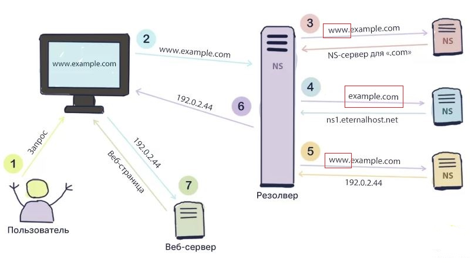

## Компьютерные сети. Лекция 1.

### Основы маршрутизации

10.0.0.0 – адрес сети, содержит хосты от 10.0.0.0 – 10.255.255.255;\
10.1.1.1– адрес хоста, хост находится в сети 10.0.0.0.

Как узнать свой адрес в Интернете?\
Например: https://whoer.net/ru - сервис проверки информации, передаваемой вашим компьютером в сеть Интернет.

Т.к. все подсети распределяются специальной организацией, оная ведёт публичную БД, в которой есть привязка адресов сетей к организациям, которым они принадлежат.
Вся эта система БД называется __whois__ и для работы с ней создана одноимённая утилита.

Устанавливаем утилиту whois: `sudo apt-get install whois`

Пример на основе адреса домена `nwgsm.ru`:
```sh
vagrant@vagrant:~$ host nwgsm.ru
nwgsm.ru has address 83.149.0.130
nwgsm.ru mail is handled by 5 mail.nwgsm.ru.
```
Выше мы нашли IP принадлежащий этому домену, а затем получим всю имеющуюся в БД информацию:
```sh
vagrant@vagrant:~$ whois 83.149.0.130
% This is the RIPE Database query service.
% The objects are in RPSL format.
%
% The RIPE Database is subject to Terms and Conditions.
% See http://www.ripe.net/db/support/db-terms-conditions.pdf

% Note: this output has been filtered.
%       To receive output for a database update, use the "-B" flag.

% Information related to '83.149.0.0 - 83.149.3.255'

% Abuse contact for '83.149.0.0 - 83.149.3.255' is 'abuse-mailbox@megafon.ru'

inetnum:        83.149.0.0 - 83.149.3.255
netname:        MF-NWGSM
descr:          North-West Branch of OJSC MegaFon
country:        RU
admin-c:        MA23317-RIPE
tech-c:         MA23317-RIPE
status:         ASSIGNED PA
mnt-lower:      MEGAFON-AUTO-MNT
mnt-by:         GDC-TR-CoreIP
mnt-lower:      GDC-TR-CoreIP
mnt-domains:    MEGAFON-DNS-MNT
mnt-routes:     GDC-TR-CoreIP
geoloc:         59.90988942567071 30.491137504577637
created:        2013-04-04T13:53:50Z
last-modified:  2021-08-17T12:18:51Z
source:         RIPE

role:           Mobile
address:        Samara
nic-hdl:        MA23317-RIPE
mnt-by:         GDC-TR-CoreIP
created:        2020-02-05T11:44:29Z
last-modified:  2020-02-05T11:44:29Z
source:         RIPE # Filtered

% Information related to '83.149.0.0/21AS31213'

route:          83.149.0.0/21
descr:          North-West Branch of OJSC MegaFon Network.
origin:         AS31213
mnt-by:         GDC-TR-CoreIP
created:        2004-03-25T13:59:04Z
last-modified:  2021-08-17T12:11:45Z
source:         RIPE

% This query was served by the RIPE Database Query Service version 1.102.3 (BLAARKOP)
```

### Маршрутизация – выбор направления

Простой маршрут – движение из точки A в точку B.\
Сложный маршрут – A -> B -> C -> D -> E -> F.\
Альтернативный маршрут – A -> X -> F.

Характеристики маршрута:\
количество точек в пути – Hop count;\
время в пути или задержка – Delay.

В сети интернет маршрутизируются пакеты.\
Каждая точка маршрута – IP сеть.\
Протокол обмена маршрутами – BGP.

### Ping – доступность от точки A до точки B

Утилита `ping` использует протокол `ICMP`.

Какие у нас есть сетевые интерфейсы?
```sh
vagrant@vagrant:~$ ip a
1: lo: <LOOPBACK,UP,LOWER_UP> mtu 65536 qdisc noqueue state UNKNOWN group default qlen 1000
    link/loopback 00:00:00:00:00:00 brd 00:00:00:00:00:00
    inet 127.0.0.1/8 scope host lo
       valid_lft forever preferred_lft forever
    inet6 ::1/128 scope host
       valid_lft forever preferred_lft forever
2: eth0: <BROADCAST,MULTICAST,UP,LOWER_UP> mtu 1500 qdisc fq_codel state UP group default qlen 1000
    link/ether 08:00:27:b1:28:5d brd ff:ff:ff:ff:ff:ff
    inet 10.0.2.15/24 brd 10.0.2.255 scope global dynamic eth0
       valid_lft 84430sec preferred_lft 84430sec
    inet6 fe80::a00:27ff:feb1:285d/64 scope link
       valid_lft forever preferred_lft forever
```
Отправим пакеты через нужный нам интерфейс:
```sh
vagrant@vagrant:~$ ping -I eth0 -c5 8.8.8.8
PING 8.8.8.8 (8.8.8.8) from 10.0.2.15 eth0: 56(84) bytes of data.
64 bytes from 8.8.8.8: icmp_seq=1 ttl=111 time=10.1 ms
64 bytes from 8.8.8.8: icmp_seq=2 ttl=111 time=9.46 ms
64 bytes from 8.8.8.8: icmp_seq=3 ttl=111 time=10.2 ms
64 bytes from 8.8.8.8: icmp_seq=4 ttl=111 time=9.86 ms
64 bytes from 8.8.8.8: icmp_seq=5 ttl=111 time=9.34 ms

--- 8.8.8.8 ping statistics ---
5 packets transmitted, 5 received, 0% packet loss, time 4029ms
rtt min/avg/max/mdev = 9.338/9.793/10.176/0.342 ms
```
Разбираем самую последнюю строку:
`rtt min/avg/max/mdev = 9.338/9.793/10.176/0.342 ms`\
Это round trip time - время доставки пакета от нас до получатея и обратно: минимальное/среднее/максимальное/отклонение


### Структура сети интернет

Интернет - это сеть сетей.\
Сеть - это набор узлов, принадлежащих одной организации. Такая сеть получает уникальный номер, называемый номером __автономной системы:__ AS\
Получается, что Интернет - это автономные системы, связанные друг с другом.

Рассмотрим картинку:



Здесь __AS__ - это автономные системы и часто, но не всегда, они и являются провайдерами интернета - __ISP__.\
Взаимодействие разных __AS__ осуществляется через точки обмена трафиком, на схеме это __IX__ , Internet eXchange. Это специальные
дата-центры, в которые ISP выводят свои физические каналы, для установления пиринга - обмена трафиком.

### Что такое __AS__ ?

- Каждый IP адрес принадлежит определенной сети;
- Каждая сеть принадлежит определенной AS;
- Каждая AS принадлежит определенной организации, обычно провайдеру
интернет;
- Каждой AS присваивается уникальный номер, обычно от 0 до 65535;
- Номера AS и принадлежащие им сети можно посмотреть в базе данных
RADB.

Посмотрим, какие IP адреса выданы конкретной __AS__ и для примера запросим адрес `nwgsm.ru`:
```sh
vagrant@vagrant:~$ whois -h whois.radb.net AS31213
aut-num:        AS31213
as-name:        MF-NWGSM-AS
remarks:        North-West Branch of PJSC MegaFon Network
org:            ORG-OM1-RIPE
remarks:
remarks:        ------------- Uplinks ----------------------------------------
remarks:
remarks:        Name: MCS-Povolzhie
import:         from AS31133 accept ANY
export:         to AS31133 announce AS-MEGAFONNW
remarks:
remarks:        Name: Peterstar
import:         from AS20632 accept ANY
export:         to AS20632 announce AS-MEGAFONNW
remarks:
remarks:        ------------- Private Peering ---------------------------------
remarks:        ---------------------------------------------------------------
remarks:
admin-c:        DUMY-RIPE
tech-c:         DUMY-RIPE
status:         ASSIGNED
mnt-by:         RIPE-NCC-END-MNT
mnt-by:         MEGAFON-RIPE-MNT
mnt-by:         MEGAFON-GNOC-MNT
mnt-by:         MEGAFON-WEST-MNT
mnt-by:         MNT-MF-NWGSM
notify:         lir@megafon.ru
created:        2004-03-23T13:17:44Z
last-modified:  2018-09-04T10:01:40Z
source:         RIPE
remarks:        ****************************
remarks:        * THIS OBJECT IS MODIFIED
remarks:        * Please note that all data that is generally regarded as personal
remarks:        * data has been removed from this object.
remarks:        * To view the original object, please query the RIPE Database at:
remarks:        * http://www.ripe.net/whois
remarks:        ****************************
```
Далее, получаем список всех адресов AS31213:
```sh
vagrant@vagrant:~$ whois -h whois.radb.net -- '-i origin AS31213' | grep 'route:'
route:      85.26.128.0/21
route:          85.26.128.0/20
route:          85.26.252.0/22
route:          78.25.96.0/21
route:          37.28.160.0/21
route:          37.29.48.0/21
route:          37.29.56.0/21
...
```
Получение подобного списка всех сетей того или иного ISP позволяет, например, заблокировать к нему или от него доступы.

### Traceroute - точки пути пакетов

Эта утилита отправляет запросы по протоколы `ICMP`, но существуют утилиты, позволяющие отправлять и другие типы пакетов, например, утилита `tcptraceroute` и т.д.
Подобный тип альтернативных запросов можно использовать в сетях, где заблокирован протокол `ICMP`.

Маршрутизация для каждого пакета осуществляется индивидуально и может возникнуть такая ситуация, когда в сети образуются "петли" - это когда маршрут замыкается в кольцо. Для того чтобы защититься от подобной ситуации, когда пакет бесконечно начинает ходить по кругу, придумали добавлять в заголовок каждого пакета специальное поле `ttl` в котором содержится число от 0 до 255 и это значение уменьшается на единицу, когда пакет маршрутизируется на каком-либо узле. Т.о. получается, что любой пакет не может совершить более 255 шагов, кои зовутся хопы [hops].

Установим утилиту: `sudo apt-get install traceroute`

Пример работы:
```sh
traceroute -An 8.8.8.8
traceroute to 8.8.8.8 (8.8.8.8), 30 hops max, 60 byte packets
 1 172.27.64.1 [*] 0.699 ms 0.258 ms 0.228 ms
 2 192.168.1.1 [*] 4.512 ms 4.871 ms 4.820 ms
 3 172.19.36.1 [*] 4.699 ms 4.465 ms 4.376 ms
 4 178.219.44.252 [AS51077] 5.241 ms 5.035 ms 5.029 ms
 5 178.219.45.253 [AS51077] 4.970 ms 4.711 ms 4.611 ms
 6 80.77.167.196 [AS28917] 5.437 ms 4.610 ms 4.250 ms
 7 62.140.239.113 [AS28917] 5.666 ms 303.424 ms 303.510 ms
 8 72.14.222.198 [AS15169] 4.346 ms 3.889 ms 4.949 ms
 9 10.23.171.190 [*] 4.569 ms 10.23.171.126 [*] 4.566 ms 10.23.172.254 [*]
4.624 ms
10 72.14.233.94 [AS15169] 4.364 ms 172.253.69.170 [AS15169] 4.351 ms
108.170.250.33 [AS15169] 5.274 ms
11 108.170.250.146 [AS15169] 4.233 ms 108.170.250.34 [AS15169] 4.503 ms
108.170.250.130 [AS15169] 4.345 ms
12 * * 142.251.49.78 [AS15169] 20.534 ms
13 74.125.253.109 [AS15169] 34.007 ms 108.170.232.251 [AS15169] 20.400 ms
172.253.65.159 [AS15169] 21.995 ms
```
- ключ `-A` - это запрос номера автономной системы для каждого IP

>Обращаем внимание, что в пунктах 9, 10, 11 и т.д. отображаются несколько возможных маршрутов движения пакетов.

### Утилита MTR - live view

Эта утилита так же работает по протоколу `ICMP` и работает она в интерактивном режиме, постоянно отправляя пакеты по указанному адресу.

Установим утилиту: `sudo apt-get install mtr`

Пример работы: `vagrant@vagrant:~$ mtr -zn 8.8.8.8`

```sh
                                             My traceroute  [v0.93]
vagrant (10.0.2.15)                                                                         2022-04-14T10:05:53+0000
Keys:  Help   Display mode   Restart statistics   Order of fields   quit
                                                                            Packets               Pings
 Host                                                                     Loss%   Snt   Last   Avg  Best  Wrst StDev
 1. AS???    10.0.2.2                                                      0.0%     2    0.3   0.3   0.3   0.4   0.1
 2. AS20632  109.124.101.65                                                0.0%     2    2.3   2.2   2.1   2.3   0.2
 3. AS20632  84.204.236.93                                                 0.0%     1    3.9   3.9   3.9   3.9   0.0
 4. AS???    10.78.242.165                                                 0.0%     1    4.4   4.4   4.4   4.4   0.0
 5. AS31133  78.25.80.90                                                   0.0%     1    5.4   5.4   5.4   5.4   0.0
 6. AS31133  37.29.17.85                                                   0.0%     1    5.9   5.9   5.9   5.9   0.0
 7. AS15169  172.253.76.91                                                 0.0%     1    5.3   5.3   5.3   5.3   0.0
 8. AS15169  74.125.244.180                                                0.0%     1    5.5   5.5   5.5   5.5   0.0
 9. AS15169  72.14.232.85                                                  0.0%     1    6.3   6.3   6.3   6.3   0.0
10. AS15169  142.251.61.221                                                0.0%     1   10.8  10.8  10.8  10.8   0.0
11. AS15169  142.250.56.131                                                0.0%     1   11.6  11.6  11.6  11.6   0.0
12. (waiting for reply)
13. (waiting for reply)
14. (waiting for reply)
15. (waiting for reply)
16. (waiting for reply)
17. (waiting for reply)
18. (waiting for reply)
19. (waiting for reply)
20. (waiting for reply)
21. AS15169  8.8.8.8                                                       0.0%     1    8.6   8.6   8.6   8.6   0.0
```

## Основы DNS

Суть понятия DNS в достаточной мере изложена в статье: ["Что представляет собой DNS"](https://eternalhost.net/base/domeny/chto-takoe-dns-server)



Разберём картинку.
Что такое dns-запись или, по другому, dns-имя?

Это строка, состоящая из неких слов, разделённых точками. Причём читать эту строку надо справа налево.\
Существуют dns-записи (имена) относительные и абсолютные.\
Те имена, у которых сущетсвует точка справа - абсолютные, без точки - относительные.

Обычно мы пользуемся относительными именами.

Слова, находящиеся между точек называются доменами.

DNS - это иерархическая древовидная система. Это значит, что есть корневые домены и в данном примере это точка `.`

Домен первого уровня - это `org`\
Домен второго уровня - это `wikipedia`\
Домен третьего уровня - это `ru`

Домен каждого уровня может управлять всеми записями своих поддоменов, а может делигировать управление кому-то.

## DNS: запрос-ответ

Есть такая барышня, Юлия Эванс. Она рисует всякие айтишные комиксы. В частности, для людей на перфокартах, она нарисовала небольшой комикс о работе DNS.

Собственно, комикс и его [__источник__](https://wizardzines.com/comics/life-of-a-dns-query/)


Нормальнпя схема запроса и ответа приведена в статье в начале отого блока.
Но там есть ошибка, которую я исправил в рисунке ниже:




### Утилита DIG (domain information groper)

Она предназначена для диагностики и исследования рабо ы DNS-сервисов.

Установка: `sudo apt-get install dnsutils`

Пример работы:
```sh
vagrant@vagrant:~$ dig +trace @8.8.8.8 nwgsm.ru

; <<>> DiG 9.16.1-Ubuntu <<>> +trace @8.8.8.8 nwgsm.ru
; (1 server found)
;; global options: +cmd
.                       64038   IN      NS      e.root-servers.net.
.                       64038   IN      NS      h.root-servers.net.
.                       64038   IN      NS      l.root-servers.net.
.                       64038   IN      NS      i.root-servers.net.
.                       64038   IN      NS      a.root-servers.net.
.                       64038   IN      NS      d.root-servers.net.
.                       64038   IN      NS      c.root-servers.net.
.                       64038   IN      NS      b.root-servers.net.
.                       64038   IN      NS      j.root-servers.net.
.                       64038   IN      NS      k.root-servers.net.
.                       64038   IN      NS      g.root-servers.net.
.                       64038   IN      NS      m.root-servers.net.
.                       64038   IN      NS      f.root-servers.net.
.                       64038   IN      RRSIG   NS 8 0 518400 20220429170000 20220416160000 47671 . pm.....+8Q==
;; Received 525 bytes from 8.8.8.8#53(8.8.8.8) in 40 ms

ru.                     172800  IN      NS      a.dns.ripn.net.
ru.                     172800  IN      NS      b.dns.ripn.net.
ru.                     172800  IN      NS      d.dns.ripn.net.
ru.                     172800  IN      NS      e.dns.ripn.net.
ru.                     172800  IN      NS      f.dns.ripn.net.
ru.                     86400   IN      DS      33257 8 2 641A0BA027A1027D2FD17B5743931804EEBB329B8B514A357D1EF290 F159D79F
ru.                     86400   IN      RRSIG   DS 8 1 86400 20220430050000 20220417040000 47671 . CP....MQ==
;; Received 684 bytes from 198.97.190.53#53(h.root-servers.net) in 88 ms

nwgsm.ru.               345600  IN      NS      ns1.nwgsm.ru.
nwgsm.ru.               345600  IN      NS      ns2.nwgsm.ru.
tdui9d4jkuds8b9t86gj39pgflcnlgm5.ru. 3600 IN NSEC3 1 1 3 00FF TE33KGTAQU9M5CRQ3IBSILQU11GFGTTT NS SOA RRSIG DNSKEY NSEC3PARAM
tdui9d4jkuds8b9t86gj39pgflcnlgm5.ru. 3600 IN RRSIG NSEC3 8 2 3600 20220515120902 20220411061906 13248 ru. ZO....gFw=
cr49ogjpn5hvs7nujuuqlmvq32ikdidr.ru. 3600 IN NSEC3 1 1 3 00FF CRL6JK51C9LKS9A8DU2QQ0OGEPE1J9A8 NS DS RRSIG
cr49ogjpn5hvs7nujuuqlmvq32ikdidr.ru. 3600 IN RRSIG NSEC3 8 2 3600 20220517084615 20220404001855 13248 ru. I3....SM=
;; Received 592 bytes from 193.232.128.6#53(a.dns.ripn.net) in 32 ms

nwgsm.ru.               3600    IN      A       83.149.0.130
nwgsm.ru.               3600    IN      NS      ns2.nwgsm.ru.
nwgsm.ru.               3600    IN      NS      ns1.nwgsm.ru.
;; Received 149 bytes from 83.149.0.85#53(ns2.nwgsm.ru) in 32 ms
```

Утилита работает рекурсивно и во-первых, она запрашивает, кто управляет корневой dns-записью `.`

Здесь мы видим список корневых dns-серверов: `.  	 64038   IN  NS   e.root-servers.net.`

Далее, у сервера `h.root-servers.net` утилита выясняет, какие dns-сервера управляют доменом `ru.`\
Сервер нам сообщает соответствующий список: `ru. 	 172800  IN  NS   a.dns.ripn.net.`

У dns-сервера `a.dns.ripn.net` выясняем, кто управляет доменом `nwgsm.ru.`\
На этом этапе мы получаем не только dns-сервера домена, но и соответствующие им IP-адреса. Да, IP-адресов может быть несколько для одного домена.

Неплохое описание DIG можно найти в статье [__Команда DIG в Linux__](https://losst.ru/komanda-dig-v-linux)

### Типы DNS записей

- A — адрес ipv4, пример для домена plypan.com – dig plypan.com.
- AAAA — адрес ipv6, dig AAAA plypan.com.
- NS — авторизованный DNS сервер.
- CNAME — alias, например www.example.com -> example.com.
- MX – почтовый сервер, dig MX plypan.com.
- PTR – обратная запись, dig -x 8.8.8.8.

С подробным описанием dns-записей можно охнакомиться в соответствующей статье: [__Что такое ресурсные записи DNS__](https://help.reg.ru/hc/ru/articles/4408047057937-%D0%A7%D1%82%D0%BE-%D1%82%D0%B0%D0%BA%D0%BE%D0%B5-%D1%80%D0%B5%D1%81%D1%83%D1%80%D1%81%D0%BD%D1%8B%D0%B5-%D0%B7%D0%B0%D0%BF%D0%B8%D1%81%D0%B8-DNS)

## Основы HTTP (HyperText Transfer Protocol)

HTTP - это текстовый протокол прикладного уровня. Предназначен для для обмена информацией с помощью клиент-серверной модели.
Клиент составляет и передает запрос на сервер, затем сервер обрабатывает и анализирует его, после этого создается ответ и отправляется пользователю.
По окончании данного процесса клиент делает новую команду, и все повторяется.

Статья [__Что такое HTTP__](https://semantica.in/blog/chto-takoe-http.html) позволяет разобраться в этом вопросе.

### Telnet: читаем HTTP сообщения

```sh
telnet stackoverflow.com 80
And then paste
GET /questions HTTP/1.0
Host: stackoverflow.com
# add the 2 empty lines above but not this one
Here is a transcript
$ telnet stackoverflow.com 80
Trying 151.101.65.69...
Connected to stackoverflow.com.
Escape character is '^]'.
GET /questions HTTP/1.0
Host: stackoverflow.com
HTTP/1.1 200 OK Content-Type: text/html; charset=utf-8
```

### CLI утилиты для работы с HTTP

>curl
`sudo apt-get install curl`

>httpie - https://github.com/httpie/httpie
`sudo apt-get install httpie`

Утилиту `httpie` рекомендует использовать лектор. Говорит, что это то же, что и `curl`, но удобнее.

jq - https://github.com/stedolan/jq
`sudo apt-get install jq`

Утилита для обработки ответов от сервера `json`

yq - https://github.com/kislyuk/yq
pip3 install yq

Утилита для обработки ответов `yaml`

Запросим страницу статуса сервиса `github`:
```sh
vagrant@vagrant:~$ curl -s https://www.githubstatus.com/api/v2/status.json
{"page":{"id":"kctbh9vrtdwd","name":"GitHub","url":"https://www.githubstatus.com","time_zone":"Etc/UTC","updated_at":"2022-04-17T10:52:38.266Z"},"status":{"indicator":"none","description":"All Systems Operational"}}
```
Приведём её в удобочитаемый вид:
```sh
vagrant@vagrant:~$ curl -s https://www.githubstatus.com/api/v2/status.json | jq .
{
  "page": {
    "id": "kctbh9vrtdwd",
    "name": "GitHub",
    "url": "https://www.githubstatus.com",
    "time_zone": "Etc/UTC",
    "updated_at": "2022-04-17T10:52:38.266Z"
  },
  "status": {
    "indicator": "none",
    "description": "All Systems Operational"
  }
}
```
Можно уточнить запрос по каким-то конкретным полям:
```sh
vagrant@vagrant:~$ curl -s https://www.githubstatus.com/api/v2/status.json | jq '.status, .page.updated_at'
{
  "indicator": "none",
  "description": "All Systems Operational"
}
"2022-04-17T10:52:38.266Z"
```


### Коды HTTP сообщений

Оригинал статье на английском: [API calls and HTTP Status codes](https://itnext.io/api-calls-and-http-status-codes-e0240f78f585)

Кратко:\
Любой ответ http-сервера на запрос содержит код, состоящий из трёх цифр.\
Первая цифра кода - категория сообщения: info, success, redirection, client error, server-error.

Со всеми кодами можно ознакомиться здесь: [Список кодов состояния HTTP](https://ru.wikipedia.org/wiki/%D0%A1%D0%BF%D0%B8%D1%81%D0%BE%D0%BA_%D0%BA%D0%BE%D0%B4%D0%BE%D0%B2_%D1%81%D0%BE%D1%81%D1%82%D0%BE%D1%8F%D0%BD%D0%B8%D1%8F_HTTP)

### Дополнительные материалы от лектора

[Всё про DNS](https://kozl.notion.site/DNS-1a76f44ee07343e5a62e490f2eb9c5f4)

[Реверс-инжиниринг HTTP(S) API](https://kozl.notion.site/HTTP-S-API-416bcf39fa244f01a42f3ee487760222)


