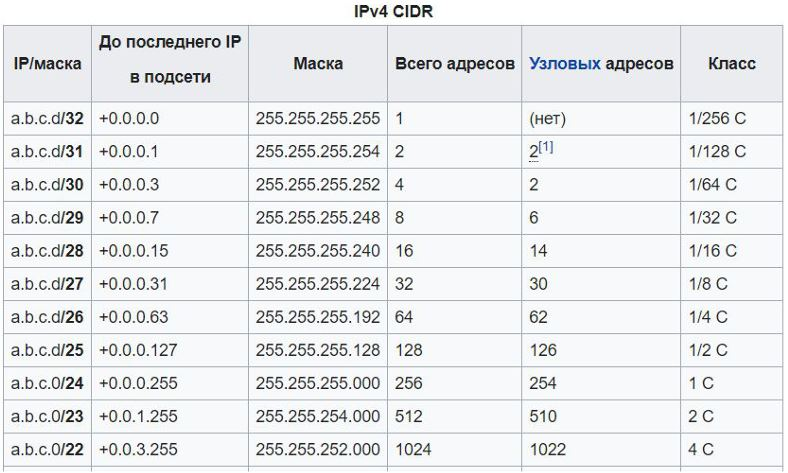

## Компьютерные сети. Лекция 2.

### Модель OSI. Протоколы и уровни


- _Прикладной_ уровень - уровень сетевой службы. Здесь работаю протоколы, реализующие прикладные задачи;
- Уровень _Представления_ - отвечает за кодирование, шифрование данных;
- _Сеансовый_ уровень - решает задачу установки и поддержания активного сеанса, даже если нет активного обмена данными;
- _Транспортный_ уровень - отвечает за конечное взаиможействие двух узлов, даёт гарантии надёжности передачи данных;
- _Сетевой_ уровень - логический уровень, предназначен для того, чтобы смаршрутизировать передаваемые данные по разным узлам сети и пакет достиг получателя;
- _Канальный_ уровень - физический уровень, где данные передаются в пределах одной сети
- _Физический_ уровень - электромагнитные сигналы разных типов.

Одна из множества статей: [__Модель OSI - это просто__](https://wiki.merionet.ru/seti/18/model-osi-eto-prosto/)

### Модель передачи данных


## L1 - Физический уровень

### L1: состояние порта – UP, DOWN

Для диагностики интерфейсов и состояния сети используют утилиту `ip`

Отличная статья по команде `ip`: [__Утилита IP Linux__](https://losst.ru/nastrojka-seti-v-linux)

Статья от лектора с примерами: [__Linux ip Command Examples__](https://www.cyberciti.biz/faq/linux-ip-command-examples-usage-syntax/)

`ip -c -br link`\
`ip link set dev <interface> down`\
`ip link set dev <interface> up`


Состояние линков:
```sh
vagrant@vagrant:~$ ip -c -br link
lo               UNKNOWN        00:00:00:00:00:00 <LOOPBACK,UP,LOWER_UP>
eth0             UP             08:00:27:b1:28:5d <BROADCAST,MULTICAST,UP,LOWER_UP>
vagrant@vagrant:~$ ip link
1: lo: <LOOPBACK,UP,LOWER_UP> mtu 65536 qdisc noqueue state UNKNOWN mode DEFAULT group default qlen 1000
    link/loopback 00:00:00:00:00:00 brd 00:00:00:00:00:00
2: eth0: <BROADCAST,MULTICAST,UP,LOWER_UP> mtu 1500 qdisc fq_codel state UP mode DEFAULT group default qlen 1000
    link/ether 08:00:27:b1:28:5d brd ff:ff:ff:ff:ff:ff
```

### Протокол LLDP

Протокол канального уровня LLDP предназначен для обмена информацией между соседними устройствами.
Он позволяет определить к какому порту коммутатора подключен сервер.

На сетевом оборудовании этот протокол нужно специально включать и настраивать, а на сервера необходимо в первую очередь обновить ОС `sudo apt-get update`,
затем установить соответствующий пакет: `sudo apt-get install lldpd` и после стартовать одноимённую службу: `systemctl enable lldpd && systemctl start lldpd`

Пример из лекции:
```sh
root@docker_vm# lldpctl
=================================
  LLDP neighbors:
=================================
Interface: ens18, via: LLDP, RID: 1, Time: 0 day, 00:18:03
Chassis:
ChassisID: mac 18:66:da:8b:cb:bc
SysName: proxmox1.com
SysDescr: Debian GNU/Linux 10 (buster) Linux 5.3.13-1-pve #1 SMP PVE 5.3.13-1 (Thu, 05 Dec 2019 07:18:14 +0100) x86_64
MgmtIP: 192.168.10.20
Capability: Bridge, on
Capability: Router, off
```

## L2 - Коммутация

### Uplink и Downlink порты

__Uplink__ – порты в сторону ядра сети. Обычно 4-6 портов на коммутаторе.\
__Downlink__ –порты к серверам. Обычно 24-48 портов на коммутаторе.\
__Oversubscription__ – переподписка, соотношение Downlink/Uplink.

Почитать статью [Порт Uplink Vs. Обычный порт: Могу ли я использовать порт Uplink в качестве обычного порта?](https://zen.yandex.ru/media/id/5d2d875b998ed600acf9c37b/port-uplink-vs-obychnyi-port-mogu-li-ia-ispolzovat-port-uplink-v-kachestve-obychnogo-porta-5ed4d35a095c4a0a976f946c)

На канальном уровне мы говорим про фреймы и МАС адреса, про которые немного ниже.

### MAC-таблица

На коммутаторах хранятся записи вида «MAC <-> порт». Время хранения каждой записи ограничено, таймер – mac aging-time.
BUM трафик – Broadcast, Unknown-Unicast, Multicast – рассылается во все порты кроме входящего.

Пример MAC-таблицы на Cisco коммутаторе:
```sh
#show mac address-table
 Mac Address Table
-------------------------------------------
Vlan Mac Address Type Ports
---- ----------- -------- -----
 All 0100.0ccc.cccc STATIC CPU
 All 0100.0ccc.cccd STATIC CPU
 All ffff.ffff.ffff STATIC CPU
 10 0000.0c07.abcd DYNAMIC Gi0/1
 20 000b.be68.bcde DYNAMIC Gi0/2
 30 0013.6016.cdef DYNAMIC Gi0/3
```

Эту таблицу можно понять так: к порту `Gi0/1` подключено устройство с МАС-адресом `0000.0c07.abcd`

### VLAN – виртуальное разделение коммутатора на канальном уровне

VLAN ID - метка в диапазоне 1 - 4096

Статья по vlan: [__VLAN__](http://xgu.ru/wiki/VLAN)


Статья по картинке выше: [__Switching > VLAN Trunking__](http://help.sonicwall.com/help/sw/eng/published/1341040751_5.9.0/switching/l2vlan.htm)

Получается, что vlan предназначен для создания и изоляции виртуальных сетей в пределах одной физической коммутируемой сети. Всё это делается еа уровне таблиц коммутации.

### Trunk и Access порты

__Trunk порт:__
- 1 порт – много VLAN id;
- пакеты отправляются с меткой(тегом) dot1q, соответствующей VLAN id;
- VLAN без метки – __native vlan__, по умолчанию VLAN id = 1;
- 802.1q – стандарт Ethernet определяющий метки;
- используется, как правило, на Uplink портах;
- в linux устанавливается пакет vlan.

> Тегированные фреймы - это фреймы, имеющие в заголовках идентификатор vlan'a

__Access порт:__
- 1 порт – 1 VLAN id;
- порт принимает только пакеты без метки;
- используется, как правило, на портах пользователей или серверах с одним сетевым адресом.

### VLAN в linux

Кстати, современные серверные ОС Linux обычно умеют работать с транковыми портами, т.е. на порт подаётся несколько vlan'ов, далее
ставится пакет `vlan` (см. ниже) и настроить какие vlan id сервер будет выделять из всего потока фреймов. Пример настройки см. ниже.

Устанавливаем пакет: `sudo apt-get install -y vlan`

Пример настройки из лекции для `vlan id = 1400`:
```sh
nano /etc/network/interfaces

auto vlan1400
iface vlan1400 inet static
        address 192.168.1.1
        netmask 255.255.255.0
        vlan_raw_device eth0

auto eth0.1400
iface eth0.1400 inet static
        address 192.168.1.1
        netmask 255.255.255.0
        vlan_raw_device eth0
```
В ОС этот сетевой интерфейс будет выглядеть, как отдельный, т.е. в ОС будет 2 интерфейса - `eth0` и `eth0.1400`
Первый - транковый, второй - для vlan 1400.


Статья [__Vlan в Ubuntu__](http://xgu.ru/wiki/VLAN_%D0%B2_Ubuntu)

### LAG – агрегация портов

*Это тоже канальный уровень.*

Технология агрегации портов позволяет объеденить несколько физических сетевых интерфейсов в один виртуальный.

В Linux агрегация портов называется __бондингом__ и имена интерфейсов будут bond0, bond1. В Windows - тиминг.

- Используется для увеличения полосы в сторону сервера;
- Как правило, на сервере имеется 3-4 сетевых интерфейса;
- Позволяет использовать несколько физических интерфейсов как один логический.

Есть у LAG некоторые ограничения.\
Например, если у нас 2 и более каналов в сторону одного и того же коммутатора, то LAG организовывается просто и понятно.\

Но если у нас пара каналов идёт к разным коммутаторам, то возникает сложность с тем, чтобы оба коммутатора могли ещё и
обмениваться между собой информацией о том, какие именно физические порты на них объединены в логические. Из-за подобных
сложностей технологию LAG в этом случает стараются не использовать. В этом случае можно использовать маршрутизацию.

Устанавливают пакет: `sudo apt-get install -y ifenslave`\
И ещё необходимо подгрузить модуль бондинг: `modprobe bonding`. ХЗ что это. Взято из лекций.

Типы LAG:
- статический (на Cisco mode on);
- динамический – LACP протокол (на Cisco mode active).

Хорошая статья с примерами: [__Объединение сетевых интерфейсов в Linux. Настройка bonding__](https://itproffi.ru/obedinenie-setevyh-interfejsov-v-linux-nastrojka-bonding/)

Статьи от лектора:
1. [This article will show how to "bond" two Ethernet connections together to create an auto failover interface.](https://wiki.debian.org/Bonding)
2. [Агрегирование каналов](http://xgu.ru/wiki/%D0%90%D0%B3%D1%80%D0%B5%D0%B3%D0%B8%D1%80%D0%BE%D0%B2%D0%B0%D0%BD%D0%B8%D0%B5_%D0%BA%D0%B0%D0%BD%D0%B0%D0%BB%D0%BE%D0%B2)


## L3: IP адресация


Протоколы, живущие на L3 отвечают за маршрутизацию данных, а точнее пакетов. Здесь мы говорим о маршрутизации по сетям - это классы сетей, здесь же живут таблицы маршрутизации.

О классах ниже.

### Классовая адресация сетей


Class A – большая сеть, свыше 16 миллионов хостов в каждой сети.\
Class B – 65 534 хостов в каждой сети.\
Class C – 254 хоста.

Обратим внимание на первые биты на зелёном фоне - они определяют класс сети.

> Выделим их цветом на следующем рисунке.

### IP классы


Но на самом деле, это всё уже устаревшая технология, которая нигде не используется.

### CIDR – бесклассовая адресация – маски

Современная технология - это безклассовая адресация, когда используется __маска подсети__.

Пару слов по картинке ниже.

Например, `/30` - это обозначение маски подсети. Она имеет такой же вид, как и IP4-адрес, но первые 30 символов  - это единицы, а оставшиеся - нули. Маска накладывается
на IP4-адрес и в тех частях, где значения равны единицам - будет определяться адрес подсети, а там, где нули - адреса хостов.



### ipcalc – cli ip калькулятор

Установить пакет: `sudo apt-get install ipcalc`


Посмотрим работу этой утилиты, и определим, сколько IP4-адресов дают разные маски подсетей.
```sh
vagrant@vagrant:~$ ipcalc 192.168.1.1/24
Address:   192.168.1.1          11000000.10101000.00000001. 00000001
Netmask:   255.255.255.0 = 24   11111111.11111111.11111111. 00000000
Wildcard:  0.0.0.255            00000000.00000000.00000000. 11111111
=>
Network:   192.168.1.0/24       11000000.10101000.00000001. 00000000
HostMin:   192.168.1.1          11000000.10101000.00000001. 00000001
HostMax:   192.168.1.254        11000000.10101000.00000001. 11111110
Broadcast: 192.168.1.255        11000000.10101000.00000001. 11111111
Hosts/Net: 254                   Class C, Private Internet

vagrant@vagrant:~$ ipcalc 192.168.100.0/23
Address:   192.168.100.0        11000000.10101000.0110010 0.00000000
Netmask:   255.255.254.0 = 23   11111111.11111111.1111111 0.00000000
Wildcard:  0.0.1.255            00000000.00000000.0000000 1.11111111
=>
Network:   192.168.100.0/23     11000000.10101000.0110010 0.00000000
HostMin:   192.168.100.1        11000000.10101000.0110010 0.00000001
HostMax:   192.168.101.254      11000000.10101000.0110010 1.11111110
Broadcast: 192.168.101.255      11000000.10101000.0110010 1.11111111
Hosts/Net: 510                   Class C, Private Internet

vagrant@vagrant:~$ ipcalc 192.168.100.0/25
Address:   192.168.100.0        11000000.10101000.01100100.0 0000000
Netmask:   255.255.255.128 = 25 11111111.11111111.11111111.1 0000000
Wildcard:  0.0.0.127            00000000.00000000.00000000.0 1111111
=>
Network:   192.168.100.0/25     11000000.10101000.01100100.0 0000000
HostMin:   192.168.100.1        11000000.10101000.01100100.0 0000001
HostMax:   192.168.100.126      11000000.10101000.01100100.0 1111110
Broadcast: 192.168.100.127      11000000.10101000.01100100.0 1111111
Hosts/Net: 126                   Class C, Private Internet
```

Эта же утилита позволяет разделить указанную сеть на подсети с заданным количеством хостов:
```sh
vagrant@vagrant:~$ ipcalc -b --split 10 20 192.168.100.0/24
Address:   192.168.100.0
Netmask:   255.255.255.0 = 24
Wildcard:  0.0.0.255
=>
Network:   192.168.100.0/24
HostMin:   192.168.100.1
HostMax:   192.168.100.254
Broadcast: 192.168.100.255
Hosts/Net: 254                   Class C, Private Internet

1. Requested size: 10 hosts
Netmask:   255.255.255.240 = 28
Network:   192.168.100.32/28
HostMin:   192.168.100.33
HostMax:   192.168.100.46
Broadcast: 192.168.100.47
Hosts/Net: 14                    Class C, Private Internet

2. Requested size: 20 hosts
Netmask:   255.255.255.224 = 27
Network:   192.168.100.0/27
HostMin:   192.168.100.1
HostMax:   192.168.100.30
Broadcast: 192.168.100.31
Hosts/Net: 30                    Class C, Private Internet

Needed size:  48 addresses.
Used network: 192.168.100.0/26
Unused:
192.168.100.48/28
192.168.100.64/26
192.168.100.128/25
```

### IPv4 Частные подсети

Частные подсети стандартизированы.

Используются в локальных сетях, не маршрутизируемых в интернете.

> Кстати, в локальной сети нельзя использовать чужие публичные IP адреса, из-за этого вы потеряете доступ к этим адресам в сети интернет.

10.0.0.0 — 10.255.255.255 (маска подсети: 255.0.0.0 или /8)\
172.16.0.0 — 172.31.255.255 (маска подсети: 255.240.0.0 или /12)\
192.168.0.0 — 192.168.255.255 (маска подсети: 255.255.0.0 или /16)\
100.64.0.0 — 100.127.255.255 (маска подсети: 255.192.0.0 или /10) Carrier-Grade NAT.

### IPv4 Специальные подсети

Они тоже стандартизированы.

Эти подсети тоже нельзя использовать в публичных сетях!

127.0.0.0/8 – localhost, для передачи внутри хоста.\
169.254.0.0/16 – автоназначение, если настроено получение адреса по DHCP, но ни один сервер не отвечает.\
224.0.0.0/4 – мультикаст - многоадресная рассылка.\
240.0.0.0/4 – зарезервировано для использования в будущем.

На самом деле подобных специальных сетей довольно много и с полным списком можно ознакомиться [__тут__](https://ru.wikipedia.org/wiki/IPv4#%D0%9D%D0%B0%D0%B7%D0%BD%D0%B0%D1%87%D0%B5%D0%BD%D0%B8%D1%8F_%D0%BF%D0%BE%D0%B4%D1%81%D0%B5%D1%82%D0%B5%D0%B9)

### ARP-таблица.

> ARP протокол связывает адреса уровней L2 и L3

- ARP предназначен для определения MAC-адреса по IP-адресу и в обратную сторону;
- работает только для IP адресов внутри одной подсети

Утилита `arp` содержится в пакете `net-tools`, который необходимо установить: `sudo apt-get install net-tools`

### Шлюз по умолчанию – Default gateway

- адрес шлюза должен быть в одной сети с хостом;
- шлюз по умолчанию настраивается один раз на хост;
- если у хоста несколько сетевых интерфейсов, шлюз по умолчанию настраивается только на одном из них;
- как правило, для шлюза по умолчанию выбирают первый доступный адрес в сети.

### ip – linux cli утилита

`ip link` – состояние интерфейсов;\
`ip address` – IP адреса интерфейсов;\
`ip neighbour` – ARP таблица;\
`ip route` – таблица маршрутизации.

Примеры использования:
```sh
vagrant@vagrant:~$  ip -c -br link
lo               UNKNOWN        00:00:00:00:00:00 <LOOPBACK,UP,LOWER_UP>
eth0             UP             08:00:27:b1:28:5d <BROADCAST,MULTICAST,UP,LOWER_UP>
vagrant@vagrant:~$ ip -c -br address
lo               UNKNOWN        127.0.0.1/8 ::1/128
eth0             UP             10.0.2.15/24 fe80::a00:27ff:feb1:285d/64
vagrant@vagrant:~$ ip -c neighbour
10.0.2.2 dev eth0 lladdr 52:54:00:12:35:02 REACHABLE
vagrant@vagrant:~$  ip -c route
default via 10.0.2.2 dev eth0 proto dhcp src 10.0.2.15 metric 100
10.0.2.0/24 dev eth0 proto kernel scope link src 10.0.2.15
10.0.2.2 dev eth0 proto dhcp scope link src 10.0.2.15 metric 100
```

## Материалы от лектора

[__Сети для самых маленьких__](https://linkmeup.gitbook.io/sdsm/)

[__Xgu.ru - wiki по сетевым технологиям__](http://xgu.ru/wiki/%D0%9A%D0%B0%D1%82%D0%B5%D0%B3%D0%BE%D1%80%D0%B8%D1%8F:%D0%9A%D0%B0%D0%BD%D0%B0%D0%BB%D1%8C%D0%BD%D1%8B%D0%B9_%D1%83%D1%80%D0%BE%D0%B2%D0%B5%D0%BD%D1%8C)

[__Краткая справка по работе с утилитой ip__](https://access.redhat.com/sites/default/files/attachments/rh_ip_command_cheatsheet_1214_jcs_print.pdf)
