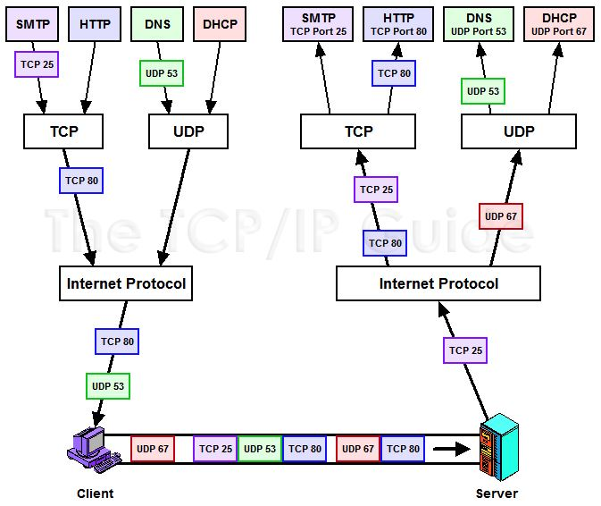
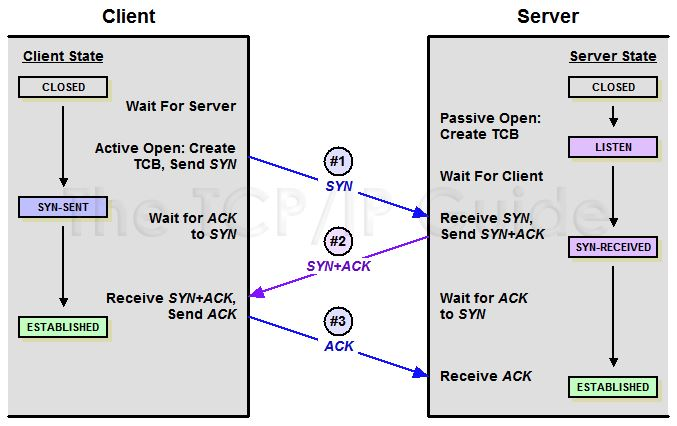
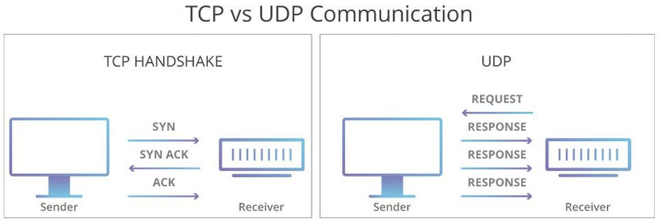
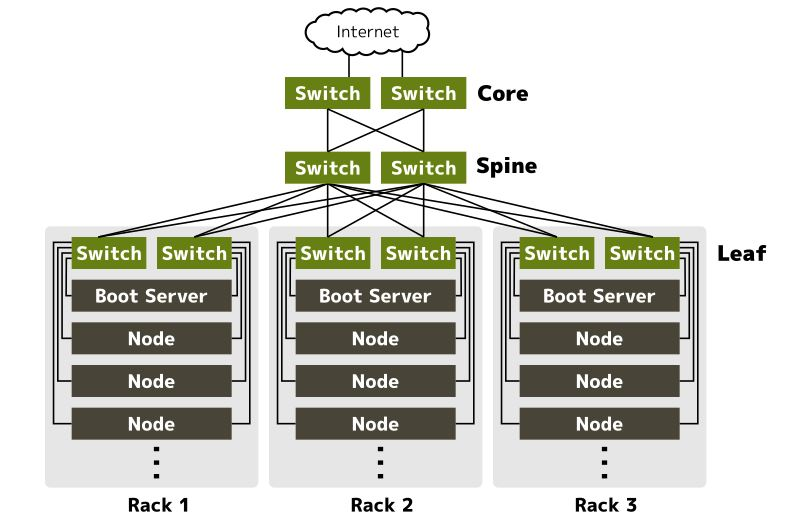
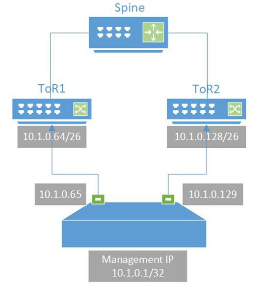
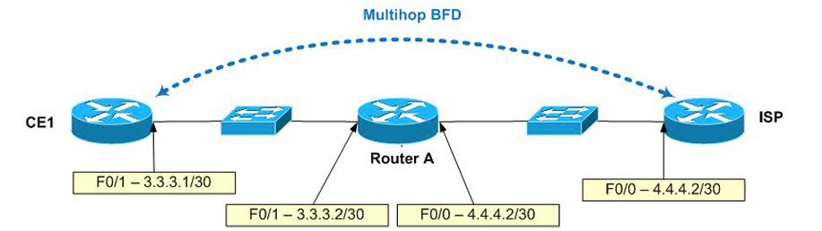
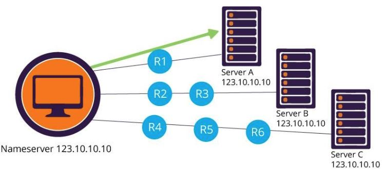
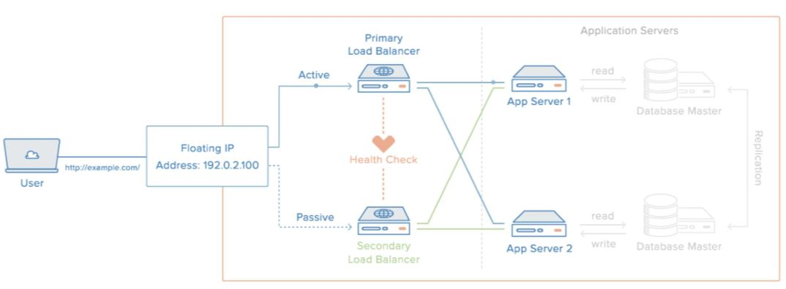

## Компьютерные сети. Лекция 3.

### Таблица маршрутизации

### Статические и динамические маршруты

__Статические маршруты__ прописываются вручную на каждом маршрутизаторе, через который проходит пакет. Например, если на пути пакета 10 маршрутизаторов, чтобы добавить 1 маршрут, нужно прописать этот маршрут 10 раз.

Преимущества статических маршрутов: не требуются дополнительные протоколы.

__Динамические маршруты__ распространяются протоколами маршрутизации. Например RIP, OSPF, BGP. Динамический маршрут настраивается один раз на маршрутизаторе-источнике (origin) и далее анонсируется по сети автоматически.

Преимущество динамических маршрутов: простота администрирования сети.

### Таблица маршрутизации в Cisco

Основные правила выбора маршрута:
- Маршрут с длинной маской выигрывает. Например /24 приоритетней чем /18;
- У каждого протокола есть приоритет - _preference_. Чем меньше _preference_, тем приоритетней маршрут. Например, _preference_ для eBGP = 20, Static = 1. (См. ниже);
- Внутри одного протокола выигрывает маршрут с лучшей метрикой. Для eBGP, как правило, это атрибут AS-PATH – список всех AS на пути к сети. Чем меньше кол-во AS, тем выше приоритет у маршрута.

Протоколы динамической маршрутизации работают так: в ОС работает отдельный процесс поддерживающий такой протокол. Этот процесс создаёт, наполняет и поддерживает общую для всех таблицу маршрутизации.
Каждый протокол имеет свой приоритет - _preference_, он определяет приоритетность маршрута в таблице маршрутизации. Чем ниже значение _preference_, тем выше приоритет. Например, протокол eBGP (external BGP) имеет приоритет
выше, чем у статического маршрута и т.о. если на маршрутизаторе будет 2 абсолютно одинаковых маршрута один из которых был добавлен каким-то динамическим протоколом, а второй был добавлен статически, то статический будет
иметь более высокий приоритет т.к. у статики _preference_ ниже.

>Внутренние протоколы маршрутизации: iBGP, OSPF, RIP. Используются внутри одной AS\
>Внешние протоколы маршрутизации: eBGP

Вообще, у каждого протокола есть поле, где определён его _preference_.

Маршрутизаторы с открытым доступом – http://www.routeservers.org/

Пример: просмотр таблицы маршрутизации на Cisco:
```sh
telnet route-views.routeviews.org
Username: rviews

> show ip route

Gateway of last resort is 128.223.51.1 to network 0.0.0.0
S*    0.0.0.0/0 [1/0] via 128.223.51.1
1.0.0.0/8 is variably subnetted, 3110 subnets, 17 masks
B        1.0.0.0/24 [20/10] via 89.149.178.10, 1d16h
B        1.0.4.0/22 [20/0] via 64.71.137.241, 3w4d
B        1.0.4.0/24 [20/0] via 64.71.137.241, 3w4d
B        1.0.5.0/24 [20/0] via 64.71.137.241, 7w0d
B        1.0.6.0/24 [20/0] via 64.71.137.241, 3w4d
B        1.0.7.0/24 [20/0] via 64.71.137.241, 7w0d
...
```

Разберём первый маршрут:
- __B__ - это название протокола, в данном случае BGP. Именно по протоколу BGP был добавлен этот маршрут в таблицу маршрутизации;
- __1.0.0.0/24__ - префикс;
- __20__ - preference;
- __10__ - метрика;
- __89.149.178.10__ - следующий hop;
- __1d16h__ - время, когда маршрут был добавлен.

Байка про OSPF.\
Этот протокол может повесить роутер из-за своего алгоритма работы - он выстраивает модель, граф, сети, а значит, если в роутере будет слишком большая таблица маршрутизации, то в процесс её
отработки OSPF просто займёт всю доступную память устройства. Байка заключается в том, что однажды в яндексе случилось подобное.

### Временные статические маршруты в Linux

Для добавления временных маршрутов в ОС Linux используется утилита `ip`, содержащаяся в пакете `iproute2`.

```sh
vagrant@vagrant:~$ ip -br route
default via 10.0.2.2 dev eth0 proto dhcp src 10.0.2.15 metric 100
10.0.2.0/24 dev eth0 proto kernel scope link src 10.0.2.15
10.0.2.2 dev eth0 proto dhcp scope link src 10.0.2.15 metric 100
```

Примеры из лекции:
```sh
# Добавление маршрута через шлюз:
ip route add 172.16.10.0/24 via 192.168.1.1

# Добавление маршрута через интерфейс:
ip route add 172.16.10.0/24 dev eth0

# Маршрут с метрикой:
ip route add 172.16.10.0/24 dev eth0 metric 100

# Просмотр маршрутов до определенной сети:
ip route show 10.0.0.0/8

# Пересылка пакетов между интерфейсами:
cat /proc/sys/net/ipv4/ip_forward
echo 1 > /proc/sys/net/ipv4/ip_forward
```

В случае пересылки пакетов важно помнить, что по умолчанию ОС Linux не маршрутизирует пакеты!\
Чтобы разрешить эту маршрутизацию, надо включить через `sysctl` или `procfs` параметр __ip_forward__ для нужного протокола - ipv4, обычно.

Так же нужно помнить, что маршруты, добавленные через утилиту `ip` добавляются __временно__!\
Для того, чтобы сделать их постоянными необходимо добавлять их в файл `/etc/network/interfaces`.

Пример из лекции:
```sh
source /etc/network/interfaces.d/*

# The loopback network interface
auto lo
iface lo inet loopback

# The production network interface
auto eth0
allow-hotplug eth0
# iface eth0 inet dhcp
# Remove the stanzas below if using DHCP.
iface eth0 inet static
  address 10.10.10.140
  netmask 255.255.255.0
  gateway 10.10.10.1
  
# The management network interface
auto eth1
allow-hotplug eth1
iface eth1 inet static
  address 172.16.100.10
  netmask 255.255.255.0
  post-up ip route add 172.16.100.0/24 dev eth1 src 172.16.100.10 table mgmt
  post-up ip route add default via 172.16.100.1 dev eth1 table mgmt
  post-up ip rule add from 172.16.100.10/32 table mgmt
  post-up ip rule add to 172.16.100.10/32 table mgmt
```
В листинге выше мы можем видеть перечисление всех имеющихся интерфейсов, ip-адреса, назначенные этим интерфейсам, маски и шлюзы.

В самом низу листинга можно видеть перечисленные маршруты в виде `post-up ip route add 172.16.100.0/24 dev eth1 src 172.16.100.10 table mgmt`.
После того, как интерфейс поднят, ОС загружает перечисленные здесь маршруты - эти строки просто выполняются в shell.

### Таблицы маршрутизации в Linux

В Linux можно настроить несколько таблиц маршрутизации. По умолчанию, если не указано имя таблицы, используется таблица `main`.

Посмотрим таблицы маршрутизации нашей ВМ:
```sh
vagrant@vagrant:~$ cat /etc/iproute2/rt_tables
#
# reserved values
#
255     local
254     main
253     default
0       unspec
#
# local
#
#1      inr.ruhep
```

Таблица маршрутизации `main` используется по умолчанию.

Таблица маршрутизации `local` используется для direct-connect маршрутов.

*Тут было немного про VRF и политики добавления маршрутов. ХЗ надо ли это.*

### Dummy интерфейсы в Linux

__Dummy__ – виртуальный интерфейс, удобно использовать для анонса маршрутов.

На сетевом оборудовании их называют __loopback__.

Dummy интерфейс, это такой виртуальный интерфейс, который мы можем создать в машине и он не будет привязан ни к одному физическому устройству.
На него назначают адрес и используют для анонсов в каком-либо протоколе динамической маршрутизации. 

Пример из лекции:
```sh
echo "dummy" >> /etc/modules
echo "options dummy numdummies=2" > /etc/modprobe.d/dummy.conf

vim /etc/network/interfaces

auto dummy0
iface dummy0 inet static
    address 10.2.2.2/32
    pre-up ip link add dummy0 type dummy
    post-down ip link del dummy0
```
С практической частью можно ознакомится в статье: [__Создание dummy интерфейсов в Linux__](https://ixnfo.com/sozdanie-dummy-interfeysov-v-linux.html)

### Bird — динамическая маршрутизация в Linux

Существует некий набор ПО которое позволяет сделать из обычной Linux-машины маршрутизатор, который будет взаимодействовать с другими узлами сети по протоколу динамической маршрутизации.
К ним относится, в частности, утилита `bird`. Она представляет собой сервис, который конфигурируется через файлы, может состоять из нескольких процессов. Эти отдельные процессы отвечают
за работу разных протоколов, которые, в свою очередь, получают набор маршрутов добавляемых в разные таблицы маршрутизации ОС. Да, таблиц маршрутизации может быть несколько.

Установка: `sudo apt-get install bird2`

Настройка: `systemctl enable bird`
		   `systemctl restart bird`

Пример конфигурационного файла `bird` из лекции:
```sh
nano /etc/bird/bird.conf

log syslog all;

protocol kernel {
        ipv4 {
			export all;     # Default is export none
		};
        persist;            # Don't remove routes on BIRD shutdown
}

protocol device {
}

protocol rip {
        ipv4 {
				import all;
                export all;
		};
        interface "ens4";
        interface "ens5";
}
protocol direct {
        ipv4;                   # Connect to default IPv4 table
        interface "dummy*";
}
```

[__BIRD User's Guide__](https://bird.network.cz/?get_doc&f=bird.html)

### birdc – консоль Bird

Подобные утилиты состоят из 2х частей: серверная и клиентская. В листинге ниже как раз и показан пример работы клиентской части `bird`.

```sh
root@ubuntu:~# birdc
BIRD 2.0.7 ready

bird> show protocols
Name       Proto      Table      State  Since         Info
kernel1    Kernel     master4    up     18:05:01.011
device1    Device     ---        up     18:05:01.011
rip1       RIP        master4    up     18:05:01.011
direct1    Direct     ---        up     18:05:01.011 

bird> show rip neighbors
rip1:
IP address                Interface  Metric Routes    Seen
192.168.12.2              ens4            1      1  27.016
192.168.120.2             ens5            1      2  13.082

bird> show route
Table master4:
10.1.1.1/32          unicast [direct1 18:05:01.033] * (240)
        dev dummy0                     
					 unicast [rip1 18:05:01.237] (120/3)
		via 192.168.120.2 on ens5
10.2.2.2/32          unicast [rip1 18:05:01.048] (120/2)
        via 192.168.12.2 on ens4 weight 1
        via 192.168.120.2 on ens5 weight 1
```

## L4: TCP/UDP

Протоколы TCP/UDP - протоколы транспортного уровня.

Помним, что уровень L3 отвечает за доставку пакета и его маршрутизацию по сети, но в то же время не гарантирует доставку пакета и порядок его доставки.
А вот уровень L4 и решает вопросы гарантированной доставки пакетов в нужном порядке, занимается мультиплексированием данных между разными приложениями - тут
у нас появляются сокеты и программные интерфейсы работы с сокетами, а так же порты. На этом уровне уже говорят не о пакетах, а о сегментах - пачке пакетов.

Смотрим картинку ниже, которая демонстрирует работу ПО по различным портам и с использованием различных протоколов.


Картинка из статьи: [__TCP/IP Ports: Transport Layer (TCP/UDP) Addressing__](http://www.tcpipguide.com/free/t_TCPIPPortsTransportLayerTCPUDPAddressing-2.htm)

Протокол TCP __обеспечивает__ надёжность передачи данных, обеспечивает механизмы повторного запроса в случае потери данных.

__Как устанавливается соединение TCP.__\
Оно называется 3-х стороннее рукопожатие: 3-Way handshake и описано в статье [__TCP Connection Establishment Process: The "Three-Way Handshake__](http://www.tcpipguide.com/free/t_TCPConnectionEstablishmentProcessTheThreeWayHandsh-3.htm).\
Рассморим картинку ниже:\


TCP в своих заголовках имеет различные флаги, которые используются для логики его работы:
- SYN - этот флаг обозначает установку соединения;
- ACK - используется для подтверждения принятия данных;

Тут же где-то есть поле с порядковым номером сегмента. Вообще, все сегменты имеют свой порядковый номер, предназначенный для того, чтобы и клиент, и сервер могли понять какой
из сегментов потерян и его нужно запросить-передать снова.

Есть ещё понятие размер окна - для того, чтобы понимать, какой размер данных можно отправлять без подтверждения.

Установка TCP-соединения в 3 рукопожатия:

Клиент отправляет сегмент с установленным флагом SYN на какой-то порт сервера и переходит в состояние SYN-SENT. Если этот порт и сокет на стороне сервера находятся в статусе *listen* т.е.
сервер слушает входящие соединения, то после получения сегмента от клиента сервер переходит в состояние *SYN-RECEIVED* и отправляет клиенту сегмент с флагами SYN+ACK -это означает, что
запрос на установку соединения принят и сервер готов обмениваться данными. Клиент, получив сегмент с флагом SYN+ACK возвращает серверу финальный сегмент с флагом ACK тем самым подтверждая получение SYN+ACK
его сокет переходит в состояние ESTABLISHED и тут же отправляет первые данные...

UDP же работает без установки сессии.

Протокол UDP __не__ обеспечивает надёжность передачи данных. Используется там, где важна скорость передачи, а не надёжность. Например, при передаче аудио данных. Ведь при потере части сегментов аудио-данных
мы этого даже не заметим т.к. используются программные средства, кодеки, которые корректируют потери. Это особенно актуально при онлайн трансляциях - скорость важнее всего.

UDP используется обычно для протоколов чувствительных к задержке, например, RTP для передачи аудио. Также используется для протоколов не чувствительных к потерям пакетов, например, Syslog, SNMP.

Схема работы протокола UDP ниже.


Для диагностики сокетов используется утилита `ss` - __Socket Statistics__.\
Хорошая статья: [__Утилита ss в Linux__](https://losst.ru/monitoring-setevyh-podklyuchenij-v-linux)

Примеры использования:
```sh
vagrant@vagrant:~$ ss -tlp
State        Recv-Q       Send-Q             Local Address:Port                Peer Address:Port       Process
LISTEN       0            4096               127.0.0.53%lo:domain                   0.0.0.0:*
LISTEN       0            128                      0.0.0.0:ssh                      0.0.0.0:*
LISTEN       0            4096                           *:9100                           *:*
LISTEN       0            128                         [::]:ssh                         [::]:*
vagrant@vagrant:~$ ss -ulp
State        Recv-Q       Send-Q              Local Address:Port               Peer Address:Port       Process
UNCONN       0            0                   127.0.0.53%lo:domain                  0.0.0.0:*
UNCONN       0            0                  10.0.2.15%eth0:bootpc                  0.0.0.0:*
```

Примеры из лекции:
```sh
ss -n
State      Recv-Q Send-Q    Local Address:Port     Peer Address:Port
ESTAB      0      240         172.31.0.14:22      172.30.10.202:51831

# порты в ожидании входящего трафика
ss -l
State      Recv-Q Send-Q    Local Address:Port   Peer Address:Port
LISTEN     0      128

# UDP сокеты
ss -ua
State      Recv-Q Send-Q     Local Address:Port     Peer Address:Port
UNCONN     0      0           172.31.0.255:ntp                 *:*

# Показать процесс использующий сокет
ss -p
State      Recv-Q Send-Q      Local Address:Port   Peer Address:Port
ESTAB      0      240           172.31.0.14:ssh   172.30.10.202:51831
users:(("sshd",13548,3))

# Фильтр по Source port
ss -au sport = :123
State      Recv-Q Send-Q    Local Address:Port     Peer Address:Port
UNCONN     0      0          172.31.0.255:ntp                 *:*

# Статистика ss -s
Total: 43 (kernel 0) TCP:   2 (estab 1, closed 0, orphaned 0, synrecv 0, timewait 0/0), ports 0

Transport Total     IP        IPv6
*         0         -         -
RAW       0         0         0
UDP       4         4         0
TCP       2         2         0
```

## Отказоустойчивость сети

Статья: [__Дизайн сети в датацентре__](https://blog.kintone.io/entry/neco/network-design)




__ECMP — несколько равнозначных маршрутов__



Равнозначные маршруты - это когда в таблице маршрутизации существут 2 и более различных маршрута до узла или сети назначения, которые используют разные физические каналы.
Эти маршруты имеют одинаковую стоимость (cost) и, значит, все каналы используются сразу.\
Например, 5-tuples - это когда берётся связка {адрес источника и адрес получателя} + {порт источника и порт получателя} + протокол 4-го уровня. Вот эта пятёрка параметров
характеризует сессию, от неё берётся хэш и т.о. все пакеты, принадлежащие этой сессии, отправляются строго по одному из нескольких имеющихся маршрутов для того, чтобы повысить
надёжность, скорость и последовательность передачи данных.


__BFD ускоряет сходимость сети__

__Сходимость сети__ – время требуемое на перестроение маршрутов при падении линка.

BFD протокол:
- поднимает сессию между соседями в другом протоколе - RIP, OSPF, BGP;
- BFD заменяет медленный механизм типа keepalive у протоколов маршрутизации;
- обеспечивает сходимость менее 50ms.



Статья по теме [__BGP и BFD на Cisco__](http://ciao-cacao.blogspot.com/2011/12/bgp-bfd.html)

__Anycast — одинаковые IP на серверах__

- Отказоустойчивость снаружи ДЦ, георезервирование ДЦ;
- Маршрутизация клиента осуществляется к ближайшему серверу;
- Сервера располагаются, как правило, в разных ДЦ;
- При отказе одного ДЦ – трафик уйдет в оставшиеся живые ДЦ.



Статья [__Anycast против Unicast: что лучше выбирать в каждом случае__](https://habr.com/ru/company/ruvds/blog/511050/)


### First-Hop Redundancy Protocols – VRRP, HSRP

Это протоколы, который позволяет обеспечить отказоустойчивость шлюза по умолчанию.

Сервисы, требующие высокой доступности, обычно используют плавающие IP-адреса. Плавающий IP-адрес может быть автоматически переброшен между несколькими серверами в ходе переключения
на резерв из-за выхода из строя основного сервера или для обновления программного обеспечения без простоев. См. картинку и видео по ссылке ниже.



Видео: [How To Set Up Highly Available HAProxy Servers with Keepalived and Floating IPs on Ubuntu 14.04](https://www.digitalocean.com/community/tutorials/how-to-set-up-highly-available-haproxy-servers-with-keepalived-and-floating-ips-on-ubuntu-14-04#visualizing-the-transition)

> В линуксе это всё настраивается с помощью сервиса `Keepalived`. Это реализация протокола VRRP на Linux.

Отличная статья: [__Отказоустойчивый кластер с балансировкой нагрузки с помощью keepalived__](https://habr.com/ru/post/524688/)

### Балансировка нагрузки

__Nginx — L4/L7 балансировщик__

[__Как настроить nginx в качестве балансировщика нагрузки__](https://blog.listratenkov.com/kak-nastroit-nginx-v-kachestve-balansirovshhika-nagruzki/)

Вообще, балансировка нагрузки может работать и работает на разных уровнях - с L3 по L7.

__Nginx — пример конфига:__
```sh
http {
  upstream backend1 {
   server 192.168.0.1;
   server 192.168.0.2;
   server 192.168.0.3;  
  }
  server {
   listen 80;

   location / {
	proxy_pass http://backend1;
   }  
 }
}

# балансировка UDP - DNS
stream {
  upstream dns_backends {
    server 8.8.8.8:53;
    server 8.8.4.4:53;
  }

  server {
    listen 53 udp;
    proxy_pass dns_backends;
    proxy_responses 1;
  }
}
```

## Документирование сети

### IP план — таблица в Excel

Заполняется вручную, быстро теряет актуальность при изменениях IP

[__Теория и практика DMVPN__](https://linkmeup.gitbook.io/sdsm/7.-vpn/5.-dmvpn/0.-teoriya-i-praktika)


### IP план — IPAM система Netbox

Возможно, настроить автоматизацию – импорт IP из конфигов. API для скриптов.

Лектор рекомендует: [Installing NetBox - NetBox Documentation](https://docs.netbox.dev/en/stable/installation/)

### Диаграммы в diagrams.net и draw.io

L1/L2 диаграммы, L3 диаграммы.\
Тип диаграмм в diagrams.net – Network.

[Схемы сети](https://linkmeup.gitbook.io/sdsm/0.-planirovanie/1.-shemi-seti)

[Flowchart Maker & Online Diagram Software](https://app.diagrams.net/)

-----
### Доп. материалы

[__Сети современных датацентров__](https://linkmeup.ru/blog/1262/)

[__МАРШРУТИЗАЦИЯ В LINUX__](https://losst.ru/marshrutizatsiya-v-linux)

[__Нестандартные трюки, которые помогут настроить сеть в Linux__](https://xakep.ru/2019/06/06/tricky-linux/)

Отличная статья по установке и настройке Ngnix: [__Установка Nginx в Ubuntu 20.04__](https://www.digitalocean.com/community/tutorials/how-to-install-nginx-on-ubuntu-20-04-ru)

И дополнительно пример настройки Ngnix, как балансировщика для http-запросов: [__Балансировка нагрузки с помощью NGINX__](https://www.dmosk.ru/miniinstruktions.php?mini=nginx-balancing)
