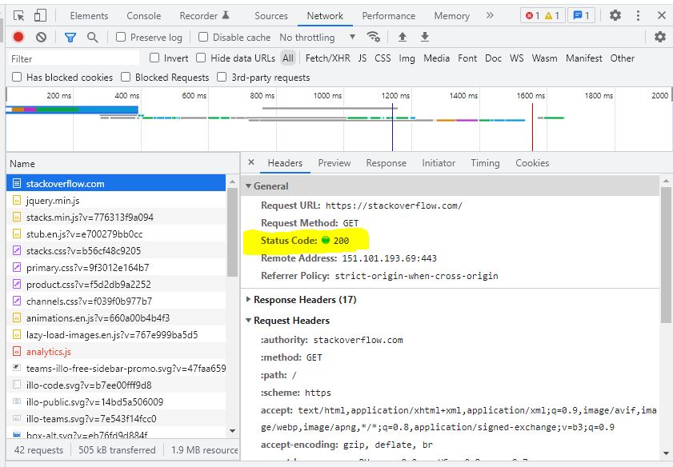
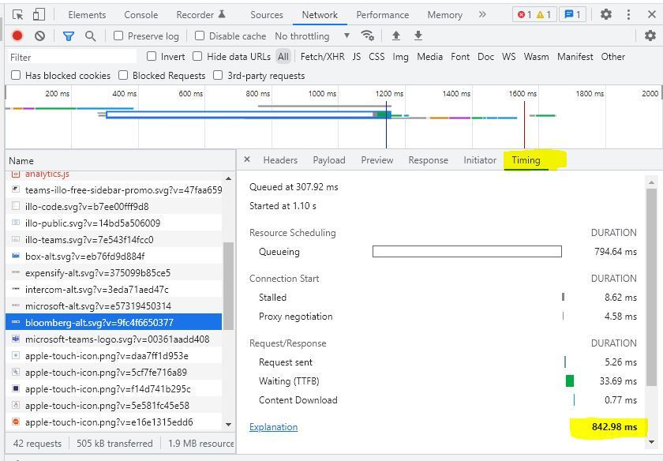

## Домашнее задание к занятию "3.6. Компьютерные сети, лекция 1"

### 1. Работа c HTTP через телнет.
Подключитесь утилитой телнет к сайту stackoverflow.com telnet stackoverflow.com 80\
отправьте HTTP запрос:
```sh
GET /questions HTTP/1.0
HOST: stackoverflow.com
[press enter]
[press enter]
```
В ответе укажите полученный HTTP код, что он означает?


=Выполнение=
----

Лог:
```sh
vagrant@vagrant:~$ telnet stackoverflow.com 80
Trying 151.101.193.69...
Connected to stackoverflow.com.
Escape character is '^]'.
GET /questions HTTP/1.0
HOST: stackoverflow.com

HTTP/1.1 301 Moved Permanently
cache-control: no-cache, no-store, must-revalidate
location: https://stackoverflow.com/questions
x-request-guid: ed23f4cb-c0cd-4b31-a914-b563e22706fe
feature-policy: microphone 'none'; speaker 'none'
content-security-policy: upgrade-insecure-requests; frame-ancestors 'self' https://stackexchange.com
Accept-Ranges: bytes
Date: Sun, 17 Apr 2022 13:12:38 GMT
Via: 1.1 varnish
Connection: close
X-Served-By: cache-hhn4049-HHN
X-Cache: MISS
X-Cache-Hits: 0
X-Timer: S1650201158.413910,VS0,VE169
Vary: Fastly-SSL
X-DNS-Prefetch-Control: off
Set-Cookie: prov=9c377ed4-9517-5ad2-ca37-c64687e85425; domain=.stackoverflow.com; expires=Fri, 01-Jan-2055 00:00:00 GMT; path=/; HttpOnly

Connection closed by foreign host.
```
__HTTP/1.1 301 Moved Permanently - запрошенный документ был окончательно перенесен на новый URI, указанный в поле `Location` т.е. сюда: https://stackoverflow.com/questions__

=Выполнено=
----


### 2. Повторите задание 1 в браузере, используя консоль разработчика F12.
- откройте вкладку Network
- отправьте запрос http://stackoverflow.com
- найдите первый ответ HTTP сервера, откройте вкладку Headers
- укажите в ответе полученный HTTP код.
- проверьте время загрузки страницы, какой запрос обрабатывался дольше всего?
- приложите скриншот консоли браузера в ответ.

=Выполнение=
----

__Полученный HTTP код: 200 -  OK — успешный запрос__


__Дольше всего грузилать какая-то статистика:__


=Выполнено=
----

__3. Какой IP адрес у вас в интернете?__

=Выполнение=
----

Это не мой IP, но он мне близок: 83.149.0.130

=Выполнено=
----

__4. Какому провайдеру принадлежит ваш IP адрес? Какой автономной системе AS? Воспользуйтесь утилитой `whois`__

=Выполнение=
----

Воспользуемся близким мне IP из предыдущего пункта.
```sh
vagrant@vagrant:~$ whois 83.149.0.130 | grep origin
origin:         AS31213
vagrant@vagrant:~$ whois 83.149.0.130 | grep descr
descr:          North-West Branch of OJSC MegaFon
descr:          North-West Branch of OJSC MegaFon Network.
```

=Выполнено=
----

__5. Через какие сети проходит пакет, отправленный с вашего компьютера на адрес 8.8.8.8? Через какие AS? Воспользуйтесь утилитой `traceroute`__

=Выполнение=
----

Дальше будем пользовать домашнюю сеть.

```sh
vagrant@vagrant:~$ sudo traceroute -IAn 8.8.8.8
traceroute to 8.8.8.8 (8.8.8.8), 30 hops max, 60 byte packets
 1  10.0.2.2 [*]  0.491 ms  0.576 ms  0.502 ms
 2  192.168.1.1 [*]  2.391 ms  1.938 ms  3.530 ms
 3  10.20.0.1 [*]  2.156 ms  4.686 ms  3.344 ms
 4  79.175.3.253 [AS12418]  5.432 ms  4.989 ms  5.232 ms
 5  10.98.78.2 [*]  5.749 ms  5.260 ms  7.217 ms
 6  178.18.227.12 [AS50952]  6.667 ms  5.916 ms  5.722 ms
 7  74.125.244.180 [AS15169]  5.551 ms  5.396 ms  5.881 ms
 8  72.14.232.85 [AS15169]  5.068 ms  4.912 ms  4.755 ms
 9  142.251.51.187 [AS15169]  9.285 ms  9.124 ms  7.840 ms
10  142.250.56.127 [AS15169]  7.653 ms  9.202 ms  9.011 ms
11  * * *
12  * * *
13  * * *
14  * * *
15  * * *
16  * * *
17  * * *
18  * * *
19  * * *
20  8.8.8.8 [AS15169]  7.567 ms  7.407 ms  7.245 ms
```

=Выполнено=
----

__6. Повторите задание 5 в утилите `mtr`. На каком участке наибольшая задержка - delay?__

=Выполнение=
----

```sh
vagrant@vagrant:~$ mtr -zn 8.8.8.8

                               My traceroute  [v0.93]
vagrant (10.0.2.15)                                       2022-04-17T14:06:48+0000
Keys:  Help   Display mode   Restart statistics   Order of fields   quit
                                          Packets               Pings
 Host                                   Loss%   Snt   Last   Avg  Best  Wrst StDev
 1. AS???    10.0.2.2                    0.0%    10    2.0   1.9   1.1   2.8   0.5
 2. AS???    192.168.1.1                 0.0%    10    5.5   4.8   3.9   6.0   0.7
 3. AS???    10.20.0.1                   0.0%    10    5.6   4.1   2.8   5.6   1.2
 4. AS12418  79.175.3.253                0.0%    10    4.8   5.3   4.7   7.8   0.9
 5. AS???    10.98.78.2                  0.0%    10    6.5   5.7   4.8   6.6   0.7
 6. AS???    178.18.227.12               0.0%    10    5.7   6.6   4.8  14.6   3.0
 7. AS15169  74.125.244.180              0.0%    10    6.0   8.1   4.8  19.2   4.7
 8. AS15169  72.14.232.85                0.0%    10    7.4   6.0   4.9   7.4   0.9
 9. AS15169  142.251.51.187              0.0%    10    9.7  15.2   8.3  29.5   7.8
10. AS15169  142.250.56.127              0.0%    10   10.5  10.0   9.2  11.2   0.7
11. (waiting for reply)
12. (waiting for reply)
13. (waiting for reply)
14. (waiting for reply)
15. (waiting for reply)
16. (waiting for reply)
17. (waiting for reply)
18. (waiting for reply)
19. (waiting for reply)
20. AS15169  8.8.8.8                     0.0%     9    9.4   8.7   8.0   9.9   0.7
```

__На каком участке наибольшая задержка - delay?__
 ```
 9. AS15169  142.251.51.187              0.0%    10    9.7  15.2   8.3  29.5   7.8
```

=Выполнено=
----

__7. Какие DNS сервера отвечают за доменное имя dns.google? Какие A записи? воспользуйтесь утилитой `dig`__

=Выполнение=
----

```sh
vagrant@vagrant:~$ dig dns.google

; <<>> DiG 9.16.1-Ubuntu <<>> dns.google
;; global options: +cmd
;; Got answer:
;; ->>HEADER<<- opcode: QUERY, status: NOERROR, id: 27895
;; flags: qr rd ra; QUERY: 1, ANSWER: 2, AUTHORITY: 0, ADDITIONAL: 1

;; OPT PSEUDOSECTION:
; EDNS: version: 0, flags:; udp: 65494
;; QUESTION SECTION:
;dns.google.                    IN      A

;; ANSWER SECTION:
dns.google.             900     IN      A       8.8.4.4
dns.google.             900     IN      A       8.8.8.8

;; Query time: 52 msec
;; SERVER: 127.0.0.53#53(127.0.0.53)
;; WHEN: Sun Apr 17 14:03:31 UTC 2022
;; MSG SIZE  rcvd: 71
```
Тип записи `А` можно посмотреть отдельно:
```
vagrant@vagrant:~$ dig dns.google A +noall +answer
dns.google.             434     IN      A       8.8.8.8
dns.google.             434     IN      A       8.8.4.4
```

=Выполнено=
----

__8. Проверьте PTR записи для IP адресов из задания 7. Какое доменное имя привязано к IP? воспользуйтесь утилитой `dig`__

=Выполнение=
----

```sh
vagrant@vagrant:~$ dig -x 8.8.8.8

; <<>> DiG 9.16.1-Ubuntu <<>> -x 8.8.8.8
;; global options: +cmd
;; Got answer:
;; ->>HEADER<<- opcode: QUERY, status: NOERROR, id: 42159
;; flags: qr rd ra; QUERY: 1, ANSWER: 1, AUTHORITY: 0, ADDITIONAL: 1

;; OPT PSEUDOSECTION:
; EDNS: version: 0, flags:; udp: 65494
;; QUESTION SECTION:
;8.8.8.8.in-addr.arpa.          IN      PTR

;; ANSWER SECTION:
8.8.8.8.in-addr.arpa.   863     IN      PTR     dns.google.

;; Query time: 4 msec
;; SERVER: 127.0.0.53#53(127.0.0.53)
;; WHEN: Sun Apr 17 14:21:50 UTC 2022
;; MSG SIZE  rcvd: 73

vagrant@vagrant:~$ dig -x 8.8.4.4

; <<>> DiG 9.16.1-Ubuntu <<>> -x 8.8.4.4
;; global options: +cmd
;; Got answer:
;; ->>HEADER<<- opcode: QUERY, status: NOERROR, id: 17697
;; flags: qr rd ra; QUERY: 1, ANSWER: 1, AUTHORITY: 0, ADDITIONAL: 1

;; OPT PSEUDOSECTION:
; EDNS: version: 0, flags:; udp: 65494
;; QUESTION SECTION:
;4.4.8.8.in-addr.arpa.          IN      PTR

;; ANSWER SECTION:
4.4.8.8.in-addr.arpa.   114     IN      PTR     dns.google.

;; Query time: 12 msec
;; SERVER: 127.0.0.53#53(127.0.0.53)
;; WHEN: Sun Apr 17 14:21:57 UTC 2022
;; MSG SIZE  rcvd: 73
```
=Выполнено=
----
