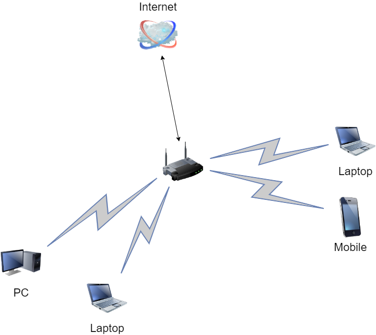

# [Домашнее задание к занятию "3.8. Компьютерные сети, лекция 3"](https://github.com/netology-code/sysadm-homeworks/blob/devsys10/03-sysadmin-08-net/README.md)

__1. Подключитесь к публичному маршрутизатору в интернет. Найдите маршрут к вашему публичному IP__

```
telnet route-views.routeviews.org
Username: rviews
show ip route x.x.x.x/32
show bgp x.x.x.x/32
```
=Выполнение=
----

```sh
route-views>show ip route 83.149.0.130
Routing entry for 83.149.0.0/21
  Known via "bgp 6447", distance 20, metric 0
  Tag 3303, type external
  Last update from 217.192.89.50 1w1d ago
  Routing Descriptor Blocks:
  * 217.192.89.50, from 217.192.89.50, 1w1d ago
      Route metric is 0, traffic share count is 1
      AS Hops 3
      Route tag 3303
      MPLS label: none
```

Листинг запроса по BGP получился на 3 экрана, а потому ниже привожу его небольшую часть:
```sh
route-views>show bgp 83.149.0.130
BGP routing table entry for 83.149.0.0/21, version 1878179763
Paths: (24 available, best #15, table default)
  Not advertised to any peer
  Refresh Epoch 1
  3333 31133 31213
    193.0.0.56 from 193.0.0.56 (193.0.0.56)
      Origin IGP, localpref 100, valid, external
      path 7FE033B04370 RPKI State not found
      rx pathid: 0, tx pathid: 0
  Refresh Epoch 1
  6939 31133 31213
    64.71.137.241 from 64.71.137.241 (216.218.252.164)
      Origin IGP, localpref 100, valid, external
      path 7FE01E0D4B98 RPKI State not found
      rx pathid: 0, tx pathid: 0
  Refresh Epoch 1
  8283 31133 31213
    94.142.247.3 from 94.142.247.3 (94.142.247.3)
      Origin IGP, metric 0, localpref 100, valid, external
      Community: 8283:1 8283:101
      unknown transitive attribute: flag 0xE0 type 0x20 length 0x18
        value 0000 205B 0000 0000 0000 0001 0000 205B
              0000 0005 0000 0001
      path 7FE152226C58 RPKI State not found
      rx pathid: 0, tx pathid: 0
....
```

----
=Выполнено=
----

__2. Создайте dummy0 интерфейс в Ubuntu. Добавьте несколько статических маршрутов. Проверьте таблицу маршрутизации.__

=Выполнение=
----

Загружаем модуль, создаём интерфейс и проверяем результат:
```sh
vagrant@vagrant:~$ sudo modprobe -v dummy numdummies=1
insmod /lib/modules/5.4.0-91-generic/kernel/drivers/net/dummy.ko numdummies=0 numdummies=1

# Загрузился ли модуль?
vagrant@vagrant:~$ lsmod | grep dummy                   
dummy                  16384  0

# Создался интерфейс?
vagrant@vagrant:~$ ip a
1: lo: <LOOPBACK,UP,LOWER_UP> mtu 65536 qdisc noqueue state UNKNOWN group default qlen 1000
    link/loopback 00:00:00:00:00:00 brd 00:00:00:00:00:00
    inet 127.0.0.1/8 scope host lo
       valid_lft forever preferred_lft forever
    inet6 ::1/128 scope host
       valid_lft forever preferred_lft forever
2: eth0: <BROADCAST,MULTICAST,UP,LOWER_UP> mtu 1500 qdisc fq_codel state UP group default qlen 1000
    link/ether 08:00:27:b1:28:5d brd ff:ff:ff:ff:ff:ff
    inet 10.0.2.15/24 brd 10.0.2.255 scope global dynamic eth0
       valid_lft 69915sec preferred_lft 69915sec
    inet6 fe80::a00:27ff:feb1:285d/64 scope link
       valid_lft forever preferred_lft forever
5: dummy0: <BROADCAST,NOARP> mtu 1500 qdisc noop state DOWN group default qlen 1000
    link/ether 42:87:92:f9:93:10 brd ff:ff:ff:ff:ff:ff

# Назначаем интерфейсу IP-адрес и проверяем
vagrant@vagrant:~$ sudo ip addr add 192.168.1.0/29 dev dummy0
vagrant@vagrant:~$ ip a | grep dummy
5: dummy0: <BROADCAST,NOARP> mtu 1500 qdisc noop state DOWN group default qlen 1000
    inet 192.168.1.0/29 scope global dummy0

# Добавляем несколько маршрутов и проверяем результат:
vagrant@vagrant:~$ sudo ip route add 83.149.0.0 via 10.0.2.2
vagrant@vagrant:~$ sudo ip route add 1.2.3.0/26 via 10.0.2.2
vagrant@vagrant:~$ sudo ip route add 3.4.5.0/27 via 10.0.2.2
vagrant@vagrant:~$ route -n
Kernel IP routing table
Destination     Gateway         Genmask         Flags Metric Ref    Use Iface
0.0.0.0         10.0.2.2        0.0.0.0         UG    100    0        0 eth0
1.2.3.0         10.0.2.2        255.255.255.192 UG    0      0        0 eth0
3.4.5.0         10.0.2.2        255.255.255.224 UG    0      0        0 eth0
10.0.2.0        0.0.0.0         255.255.255.0   U     0      0        0 eth0
10.0.2.2        0.0.0.0         255.255.255.255 UH    100    0        0 eth0
83.149.0.0      10.0.2.2        255.255.255.255 UGH   0      0        0 eth0
```

----
=Выполнено=
----

__3. Проверьте открытые TCP порты в Ubuntu, какие протоколы и приложения используют эти порты? Приведите несколько примеров.__

=Выполнение=
----

```sh
vagrant@vagrant:~$ ss -tpan
State   Recv-Q   Send-Q     Local Address:Port        Peer Address:Port   Process
LISTEN  0        4096       127.0.0.53%lo:53               0.0.0.0:*
LISTEN  0        128              0.0.0.0:22               0.0.0.0:*
ESTAB   0        0              10.0.2.15:50442     185.125.190.27:443
ESTAB   0        0              10.0.2.15:22              10.0.2.2:62994
LISTEN  0        128                 [::]:22                  [::]:*
```
__Порты:__
- 22 - SSH 
- 53 - DNS
- 443 - https

----
=Выполнено=
----

__4. Проверьте используемые UDP сокеты в Ubuntu, какие протоколы и приложения используют эти порты?__

=Выполнение=
----

```sh
vagrant@vagrant:~$ ss -upan
State    Recv-Q   Send-Q      Local Address:Port     Peer Address:Port   Process
UNCONN   0        0           127.0.0.53%lo:53            0.0.0.0:*
UNCONN   0        0          10.0.2.15%eth0:68            0.0.0.0:*
```
__Порты:__
- 53 - DNS
- 68 - DHCP-client

----
=Выполнено=
----

__5. Используя diagrams.net, создайте L3 диаграмму вашей домашней сети или любой другой сети, с которой вы работали.__


