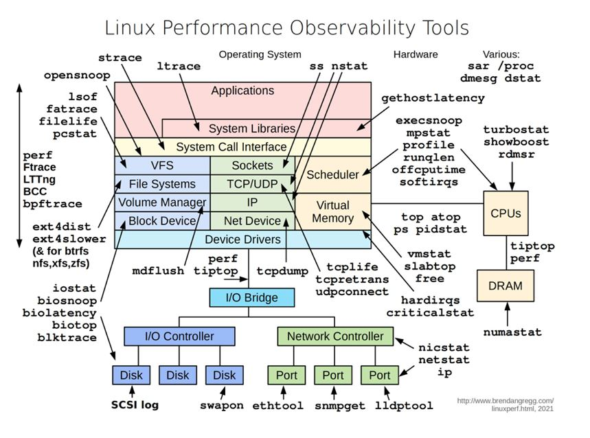
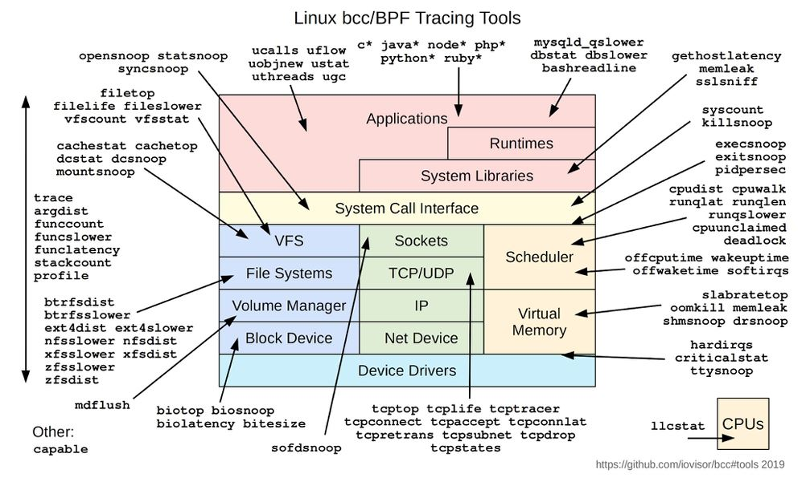

## Операционные системы. Лекция 2.

#### Оценка потребления ресурсов

Хорошая статья на тему оценки производительности __[здесь](https://netflixtechblog.com/linux-performance-analysis-in-60-000-milliseconds-accc10403c55).__

Краткая выдержка из неё по командам:

`uptime` — текущий аптайм, `Load Average` за 1, 5 и 15 минут соответственно;

`dmesg` — логи ядра `/var/log/dmesg`, здесь могут быть ошибки, которые говорят о проблемах производительности (`oomkiller`, деградация дисковой подсистемы, сети и др.)\
Лучше использовать с ключом `-Т` для адекватного отображения времени: `dmesg -T`. Сравнительные примеры ниже.

	vagrant@vagrant:~$ dmesg
	[   46.052590] 13:14:10.463798 main     Executable: /opt/VBoxGuestAdditions-6.1.30/sbin/VBoxService
               13:14:10.463799 main     Process ID: 831
               13:14:10.463799 main     Package type: LINUX_64BITS_GENERIC
	[   46.058178] 13:14:10.469384 main     6.1.30 r148432 started. Verbose level = 0
	[   46.068606] 13:14:10.479786 main     vbglR3GuestCtrlDetectPeekGetCancelSupport: Supported (#1)

Тоже самое но с адекватным отображением времени:

	vagrant@vagrant:~$ dmesg -T
	[Tue Feb 15 13:14:10 2022] 13:14:10.463798 main     Executable: /opt/VBoxGuestAdditions-6.1.30/sbin/VBoxService
                           13:14:10.463799 main     Process ID: 831
                           13:14:10.463799 main     Package type: LINUX_64BITS_GENERIC
	[Tue Feb 15 13:14:10 2022] 13:14:10.469384 main     6.1.30 r148432 started. Verbose level = 0
	[Tue Feb 15 13:14:10 2022] 13:14:10.479786 main     vbglR3GuestCtrlDetectPeekGetCancelSupport: Supported (#1)

----
Для дальнейшей работы нам потребуется большое количество разнообразных диагностических утилит.\
Все они содержатся в двух пакетах, которые необходимо будет установить, если их нет.\
Установка: `sudo apt-get install sysstat`\
Установка: `sudo apt-get install procps` - этот пакет, как правило, включён в дистрибутивы ОС.

Утилита `vmstat`, пакет `procps`.

`vmstat <interval>` — общие метрики производительности в одном месте, выводятся на терминал раз в интервал времени <interval> в секундах:
- r, b — количество процессов в состоянии R и D соответственно;
- swpd, free, buff, cache — потребление памяти в системе: файл подкачки, свободной, выделенной под буферы и кеш;
- si, so - количество операций ввода/вывода swap;
- bi, bo — количество блоков прочитанных и записанных на диск;
- in, cs - количество прерываний и количество переключенией контекста - это когда планировщик ОС переключает другой процесс на это же ядро, отключив прежний процесс;
- us, sy, id, wa — процент времени, когда CPU был утилизирован под `userspace`; `kernelspace` задачи; когда он не выполнял никакой работы; когда задачи ожидали ввода/вывода.
```sh
	vagrant@vagrant:~$ vmstat 1
	procs -----------memory---------- ---swap-- -----io---- -system-- ------cpu-----
	r  b   swpd   free   buff  cache   si   so    bi    bo   in   cs us sy id wa st
	1  0      0 1525840  42260 339852    0    0    66     6   19   79  0  0 100  0  0
	0  0      0 1525832  42260 339852    0    0     0     0   32   52  0  0 100  0  0
	0  0      0 1525832  42260 339852    0    0     0     0   31   53  0  0 100  0  0
	0  0      0 1525832  42260 339852    0    0     0     0   35   49  0  0 100  0  0
```
Причём первая строчка вывода - это среднее значение меток за всё время работы системы - не очень нужные данные.
Если выводить данные каждую секунду, то можно отловить какие-то пики в работе системы т.е. неравномерную нагрузку.

Тоже самое, но память в мегабайтах:

	vagrant@vagrant:~$ vmstat -S M 1
	procs -----------memory---------- ---swap-- -----io---- -system-- ------cpu-----
	r  b   swpd   free   buff  cache   si   so    bi    bo   in   cs us sy id wa st
	1  0      0   1490     41    331    0    0    54     5   18   68  0  0 100  0  0
	0  0      0   1490     41    331    0    0     0     0   26   36  0  0 100  0  0
	0  0      0   1490     41    331    0    0     0     0   27   41  0  0 100  0  0

----

Утилита `mpstat` ставится с пакетом `sysstat`.

`mpstat` — утилизация процессора в разрезе ядер, с помощью которой можно увидеть дисбаланс распределения нагрузки по ядрам;

В примере ниже, мы просим выводить загрузку по всем CPU каждые 2 секунды:

	vagrant@vagrant:~$ mpstat -P ALL 2
	Linux 5.4.0-91-generic (vagrant)        02/16/2022      _x86_64_        (2 CPU)
	
	02:53:34 PM  CPU    %usr   %nice    %sys %iowait    %irq   %soft  %steal  %guest  %gnice   %idle
	02:53:36 PM  all    0.00    0.00    0.00    0.00    0.00    0.00    0.00    0.00    0.00  100.00
	02:53:36 PM    0    0.00    0.00    0.00    0.00    0.00    0.00    0.00    0.00    0.00  100.00
	02:53:36 PM    1    0.00    0.00    0.00    0.00    0.00    0.00    0.00    0.00    0.00  100.00

----
Утилита `pidstat` также содержится в пакете `sysstat`.

`pidstat` — раз в интервал выводит полезные метрики утилизации ресурсов по процессам (CPU, RAM, IO);

Основные ключи утилиты:
- -t показывает треды;
- -d показывает метрики ввода/вывода;
- -r утилизация памяти;
- -u утилизация процессора.

Пример работы:

	vagrant@vagrant:~$ pidstat
	Linux 5.4.0-91-generic (vagrant)        02/16/2022      _x86_64_        (2 CPU)

	02:57:27 PM   UID       PID    %usr %system  %guest   %wait    %CPU   CPU  Command
	02:57:27 PM     0         1    0.00    0.01    0.00    0.01    0.01     1  systemd
	02:57:27 PM     0         2    0.00    0.00    0.00    0.00    0.00     1  kthreadd
	02:57:27 PM     0         9    0.00    0.00    0.00    0.00    0.00     0  ksoftirqd/0
	02:57:27 PM     0        10    0.00    0.01    0.00    0.01    0.01     1  rcu_sched
	02:57:27 PM     0       523    0.03    0.03    0.00    0.00    0.05     0  multipathd

%usr - утилизация CPU в `userspace`;\
%system - утилизация CPU в `kernelspace`. Здесь значение больше, если процесс занят вводом\выводом, т.е. чаще работаю системные вызовы;

Как обычно, больше информации в `man` или __[посмотреть тут](https://bloglinux.ru/1972-utilita-pidstat-v-unix-linux.html).__

----
Утилита `iostat`, находится в пакете `sysstat`.

`iostat` — метрики подсистемы ввода вывода дисковых устройств:
- r/s, w/s количество запросов чтения и записи к устройству;
- rkB/s, wkB/s количество байт считанных или записанных;
- avgrq-sz, avgqu-sz средний размер запроса в байтах и среднее количество запросов в очереди на обслуживание;
- r_await, w_await среднее время обслуживание запроса в миллисекундах, включая ожидание в очереди.

----

`free` — использование памяти в системе, пакет `procps`.

	vagrant@vagrant:~$ free -m
			total        used        free      shared  buff/cache   available
	Mem:           2992         136        2446           0         409        2697
	Swap:          1961           0        1961

- total - количество памяти в системе;
- user - количество памяти занятое программами;
- free - свободное количество памяти;
- shared - ;
- buff/cache - память ядра, выделенная под буфер устройств ввода/вывода и page-кэш, в котором хранятся уже прочитанные файлы;
- available - всего доступной памяти.

Ядро старается максимально оптимизировать расход памяти, поэтому всю память из free она отправляет на хранение 
буфера и кэша, но если вдруг память потребуется какому-то процессу - то она берётся именно из раздела buff/cache.

__total = used + free + buff/cache__\
Помня, что раздел buff/cache может быть _почти_ полностью освобождён, можно считать, что свободной памяти у нас __free + buff/cache__.

available - это free + buff/cache минус то, что невозможно освободить в разделе free + buff/cache.

----

Ещё одна популярная утилита для мониторинга производительности системы - __sar__.

Эта утилита не входит в стандартную поставку, она содержится в пакете `sysstat`.\
Помимо её установки, требуется настройка, а именно редактирование файлов конфигурации:\
`sudo nano /etc/default/sysstat` - в этом файле меняем строку с `ENABLED=”false”` на `ENABLED=”true”`, сохраняем.\
Теперь изменим интервал сбора информации с каждых 10 минут на каждые 2 минуты:\
`sudo vim /etc/cron.d/sysstat`:

	#Меняем строчку с
	5-55/10 * * * * root command -v debian-sa1 > /dev/null && debian-sa1 1 1
	#На
	*/2 * * * * root command -v debian-sa1 > /dev/null && debian-sa1 1 1

И перезапускаем сервис `sysstat`: `sudo service sysstat restart`

`sar` приступает к сбору информации о работе системы.

Эта утилита может показывать раличные метрики производительности:
- -n DEV, -n EDEV - утилизация сетевых интерфейсов и дропы пакетов на них - колонки `rxdrop` и `txdrop`. Это канальный уровень, фреймы ethernet;
- -n IP 1 - статистика IP-пакетов: irec, fwddgm - количество принятых и маршрутизированных пакетов;
- -n TCP, -n ETCP, -n UDP метрики TCP и UDP протоколов (кол-во соединений в секунды, ретрансмиты и др.);
- -B метрики использования page cache;
- -b, -d метрики IO по устройствам;
- -F метрики от смонтированных файловых систем;

Потери (дропы) пакетов происходят из-за того, что сетевой интерфейс слишком сильно загружен (утилизирован) и поступающие на него очередные пакеты
переполняют буфер, в результате чего ядро ОС вынуждено отбрасывать "лишние" пакеты.

----

Семейство утилит `top`: `top`, `atop`, `htop`

- `top` - выводит список активных процессов системы с сортировкой по потребляемому процессорному времени (по умолчанию).\
	Комбинация `Shift+F` включает интерактивное меню, где `s` - меняет сортировку, а `d` - включает/выключает отображение колонки;


- `atop` - программа записи истории вывода команды `top` с заданным интервалом.
	Комбинация `t`/`Shift+t` используется для перехода по интервалам,\
	`atop -r <log> -b <time>` - для старта с нужного времени.
	`echo LOGINTERVAL=10 > /etc/default/atop; systemctl restart atop`

- `htop` - более современный и удобный вариант `top`.

- `iotop` - утилита, аналогичная `top`, но для дисковой подсистемы. Помогает разобраться, какой именно процесс вызывает высокую загрузку дисков.
			Установить: `sudo apt-get install -y iotop`

- `iftop` - показывает утилизацию сети в разрезе потоков данных.
			Установить: `sudo apt-get install -y iftop`

- `nethogs` - показывает утилизацию сети в разрезе процессов.
			Установить: `sudo apt-get install -y nethogs`

----

### Инструменты.






#### Инструмент node_exporter

Приведенные выше инструменты хороши для интерактивной оценки производительности системы, но они не решают проблемы сбора исторических данных.\
Решением является связка: `Prometheus + node_exporter`.

`node_exporter` - это компонент, который собирает метрики и предоставляет их системе мониторинга. В нашем случае системе мониторинга Prometheus.

Лучше всего этот инструмент использовать для поиска проблем производительности какой-то конкретной машины, хоста т.к. собирается огромное количество метрик, которые необходимо где-то хранить.
Места для хранения не всегда достаточно, поэтому и такое, казалось бы, ограниченное применение.

>Prometheus будет рассмотрен в одной из следующих лекций.
```sh
	vagrant@netology1:~/node_exporter-1.0.1.linux-amd64$ curl -s localhost:9100/metrics
	2>/dev/null | grep node_filesystem_avail_bytes | grep mapper
	node_filesystem_avail_bytes{device="/dev/mapper/vgvagrant-root",fstype="ext4",mountpo
	int="/"} 6.075752448e+10
	
	vagrant@netology1:~/node_exporter-1.0.1.linux-amd64$ df -h | grep map
	per/dev/mapper/vgvagrant-root   62G  1.6G   57G   3% /
```

#### Ядро и модули

Версия ядра на машине:

	vagrant@vagrant:~$ uname -r
	5.4.0-91-generic

Версия и имя дистрибутива:

	vagrant@vagrant:~$ cat /etc/os-release
	NAME="Ubuntu"
	VERSION="20.04.3 LTS (Focal Fossa)"
	ID=ubuntu
	ID_LIKE=debian
	PRETTY_NAME="Ubuntu 20.04.3 LTS"
	VERSION_ID="20.04"
	HOME_URL="https://www.ubuntu.com/"
	SUPPORT_URL="https://help.ubuntu.com/"
	BUG_REPORT_URL="https://bugs.launchpad.net/ubuntu/"
	PRIVACY_POLICY_URL="https://www.ubuntu.com/legal/terms-and-policies/privacy-policy"
	VERSION_CODENAME=focal
	UBUNTU_CODENAME=focal

	vagrant@vagrant:~$ lsb_release -a
	No LSB modules are available.
	Distributor ID: Ubuntu
	Description:    Ubuntu 20.04.3 LTS
	Release:        20.04
	Codename:       focal

#### Ядро и дистрибутив

Конфигурация сборки ядра:

	vagrant@vagrant:~$ cat /boot/config-$(uname -r) | head
	#
	# Automatically generated file; DO NOT EDIT.
	# Linux/x86 5.4.0-91-generic Kernel Configuration
	#
	#
	# Compiler: gcc (Ubuntu 9.3.0-17ubuntu1~20.04) 9.3.0
	#
	CONFIG_CC_IS_GCC=y
	CONFIG_GCC_VERSION=90300


Файл, содержащий все параметры, с которыми было скомпилировано ядро:

	vagrant@vagrant:~$ cat /boot/config-5.4.0-91-generic


В современных дистрибутивах ядра распространяются в форме пакетов:

	vagrant@vagrant:~$ dpkg -l | grep linux-image-5
	ii  linux-image-5.4.0-91-generic	5.4.0-91.102	amd64	Signed kernel image generic

Установочные скрипты сами обновляют записи загрузчика, initrd и vmlinuz (бинарный образ ядра).


#### Модули ядра

Одним из способом конфигурации ядра является использование модулей.\
Ядра дистрибутивов linux могут быть двух типов: монолитные или *микро*ядра.

>Микроядро содержит минимальный набор функций. Все функции, которые только можно, выносятся "наружу"\
>и потом их можно подгружать отдельно - используя в пользовательском пространстве или отдельными компонентами.

>Монолитное ядро - бинарный файл, который содержит в себе все необходимые и присущие ОС функции.

В то же время, несмотря на его "монолитность", существуют модули ядра, которые можно загружать во время работы.

Посмотреть загруженные модули можно командой `lsmod`.

Низкоуровневая команда для загрузки нового модуля – `insmod` (insert module),\
однако есть более удобный вариант – `modprobe`, который умеет автоматически подгружать зависимости\
и не требует указания пути.

Команда `modinfo` позволяет помотреть информацию по загруженному модулю.

Пример. Сначала выводим список подключенных модулей:
```sh
	vagrant@vagrant:~$ lsmod
	Module                  Size  Used by
	vboxsf                 81920  0
	dm_multipath           32768  0
	scsi_dh_rdac           16384  0
	scsi_dh_emc            16384  0
	scsi_dh_alua           20480  0
	vboxguest             348160  2 vboxsf
	input_leds             16384  0
	serio_raw              20480  0
	mac_hid                16384  0
	sch_fq_codel           20480  2
	msr                    16384  0
	ip_tables              32768  0
	x_tables               40960  1 ip_tables
	......
```
Теперь смотрим информацию по одному из них:
```sh
	vagrant@vagrant:~$ modinfo ip_tables
	filename:       /lib/modules/5.4.0-91-generic/kernel/net/ipv4/netfilter/ip_tables.ko
	alias:          ipt_icmp
	description:    IPv4 packet filter
	author:         Netfilter Core Team <coreteam@netfilter.org>
	license:        GPL
	srcversion:     2554B35100823A61CA983B4
	depends:        x_tables
	retpoline:      Y
	intree:         Y
	name:           ip_tables
	vermagic:       5.4.0-91-generic SMP mod_unload modversions
	sig_id:         PKCS#7
	signer:         Build time autogenerated kernel key
	sig_key:        18:8C:BE:F0:31:4B:0B:E0:E3:F8:76:71:AC:C9:6E:FF:B4:AB:57:F1
	sig_hashalgo:   sha512
	signature:............
```
Модули можно подгружать или выгружать без перезагрузки всей ОС.
Однако надо помнить, что после рестарта - все необходимые модули придётся подключать заново.

В файле `/etc/modprobe.d/mdadm.conf` перечислены все модули, которые загружаются при старте системы.


#### Настройка ядра - параметры загрузки

В части параметров настройки ядро линукса аналогично обычным приложениям - оно принимает строку параметров на вход.

	vagrant@vagrant:~$ cat /proc/cmdline
	BOOT_IMAGE=/vmlinuz-5.4.0-91-generic root=/dev/mapper/ubuntu--vg-ubuntu--lv ro net.ifnames=0 biosdevname=0 quiet

В примере приведённом выше:

- загрузчик передал путь до образа, из которого загружено ядро `BOOT_IMAGE=`;
- на каком устройстве находится корневая файловая система `root=`;
- монтировать корневую файловую систему а режиме `readonly` во время загрузки `ro`;
- параметры для подсистемы `udev` об именовании сетевых интерфейсов;
- тихая загрузка `quiet`.

Естественно, у каждого дистрибутива параметры загрузки ядра свои. Мы рассматриваем только Ubuntu.
*Кстати, в Debian тоже самое*

В Ubuntu изменить параметры загрузки ядра можно через файл `/etc/default/grub` и запустив `sudo update-grub`.

	vagrant@vagrant:~$ grep GRUB_CMDLINE_LINUX /etc/default/grub
	GRUB_CMDLINE_LINUX_DEFAULT=""
	GRUB_CMDLINE_LINUX="net.ifnames=0 biosdevname=0 "

Для чего это всё может понадобится?\
Например, если утерян пароль и нет доступа к системе. Во время работы загрузчика можно поменять параметры загрузки ядра,
получив доступ к сервисному меню и передав через это сервисное меню команду запуска shell `init=/bin/sh` или `single` для single user mod.

###### `sysctl`

Однако, настройки ядра можно менять и во время его работы. Для этого существует команда `sysctl`.

>`sysctl -a` - вывод всех возможных параметров ядра

>`sysctl -w <param>` - изменить параметр.

Пример:

	vagrant@vagrant:~$ sudo sysctl -a | grep 'v4.ip_forward'
	net.ipv4.ip_forward = 0
	net.ipv4.ip_forward_update_priority = 1
	net.ipv4.ip_forward_use_pmtu = 0
	vagrant@vagrant:~$ sudo sysctl -w net.ipv4.ip_forward=1
	net.ipv4.ip_forward = 1
	vagrant@vagrant:~$ sysctl net.ipv4.ip_forward
	net.ipv4.ip_forward = 1
	vagrant@vagrant:~$


Внесенные таким образом изменения не сохранятся после перезагрузки. Чтобы сделать их постоянными, присутствует каталог /etc/sysctl.d.\
В дистрибутивах обычно ряд настроек заданы отличными от стандартных, поэтому ознакомьтесь с имеющимися там параметрами до внесения своих.

```sh
vagrant@vagrant:~$ sudo grep -v '^#' /etc/sysctl.d/* | grep = | column -t | head -n2
/etc/sysctl.d/10-console-messages.conf:kernel.printk                      =  4      4  1  7
/etc/sysctl.d/10-ipv6-privacy.conf:net.ipv6.conf.all.use_tempaddr         =  2
```

Список файлов конфигурации с параметрами загрузки ядра:
```sh
vagrant@vagrant:~$ ls /etc/sysctl.d/
10-console-messages.conf  10-kernel-hardening.conf   10-magic-sysrq.conf       10-ptrace.conf    99-sysctl.conf
10-ipv6-privacy.conf      10-link-restrictions.conf  10-network-security.conf  10-zeropage.conf  README.sysctl
```

###### dmesg, syslog/rsyslog

- `dmesg` — инструмент доступа к __логам_ядра__. В `dmesg` можно увидеть логи загрузки ОС, изменение состояния аппаратных ресурсов,\
	проблемы с дисками,	отвалившиеся сетевые карты, ошибки при коррекции ошибок ECC.
	
- `syslog` или `rsyslog` — штатный логгер, куда попадают сообщения уже от приложений в user space.\
	Позволяет очень гибко маршрутизировать логи, в том числе за пределы системы - по сети, в системы сбора логов.


#### Система инициализации: systemd

##### init — PID 1, процессы ядра

Мы узнали, что новые процессы в Linux создаются клонированием родительского процесса. Из этого правила есть понятное исключение
– первый процесс в системе, который ядро создает самостоятельно и назначает  ему  `PID 1`, – `init`.

`init`  — собирательное название для процесса инициализации ОС

Система инициализации отвечает за:
- достижение корректного состояния на разных этапах загрузки;
- запуска служб самой ОС и прикладных программ в нужном порядке;
- монтирование файловых систем;
- обратный процесс при выключении ОС;
- `init` должен уметь “усыновлять” процессы, ставшие “сиротами”.

###### systemd, systemctl

Систем инициализации было разработано много, но стандарт для большинства популярных дистрибутивов сегодня – `systemd`.

`systemd`  многие критикуют  за несоответствие философии Unix, согласно которой у программы должно быть единственное предназначение,
которое она должна выполнять хорошо. `systemd` сегодня заменяет множественные сервисы ОС: логирование, планировщик задач cron, даже локальный
кеширующий DNS и синхронизация времени.

`systemctl` - это специальный инструмент для управления службами в линукс. Статья по [__systemсtl__](https://losst.ru/upravlenie-sluzhbami-linux)

Базовые команды:
- `systemctl list-units --all` - посмотреть все *юниты* под управлением `systemd`;
- `systemctl status cron.service` - посмотреть статус работы сервиса. Сразу же виден путь расположения  юнит-файла, который отвечает  за сервис (/lib/systemd/system/cron.service в нашем случае);
- `systemctl start/stop/restart/reload cron`;
- `systemctl enable/disable cron` - управление автозапуском сервиса.

Служба в `systemd` описывается __файлом юнита__, в нем описано что с ней нужно делать и как себя вести. См. [__тут__]((https://losst.ru/upravlenie-sluzhbami-linux))

###### journalctl, systemctl

- `systemctl cat cron.service` - просмотр содержимого;
- `systemctl edit --full cron.service` - редактирование;
- `systemctl daemon-reload` - перечитать измененные юнит-файлы самого `systemd`;
- `systemctl list-dependencies cron.service` - посмотреть зависимости сервиса `cron`;

- `journalctl -b -u cron.service` - посмотреть логи сервиса `cron`, которые были записаны с момента загрузки (`b` от момента `boot`). Хранит логи в бинарном виде;

#### Linux Namespaces (NS)

Базовые технологии для контейнеризации предоставляет само ядро Linux, а инструменты (вроде Docker или LXC), которые делают обращение с ними удобнее.\
Одна из функций ядра, которую используют контейнеры — __пространства имён__. Они обеспечивают изоляцию процессов внутри контейнеров.\
Всего существует 7 видов неймспейсов (NS): 
```
Namespace   Constant          Isolates
Cgroup      CLONE_NEWCGROUP   Cgroup root directory
IPC         CLONE_NEWIPC      System V IPC, POSIX message queues
Network     CLONE_NEWNET      Network devices, stacks, ports, etc.
Mount       CLONE_NEWNS       Mount points
PID         CLONE_NEWPID      Process IDs
User        CLONE_NEWUSER     User and group IDs
UTS         CLONE_NEWUTS      Hostname and NIS domain name
```

Для запуска процесса в отдельном NS можно использовать утилиту `unshare`.

Пример:
```sh
vagrant@vagrant:~$ sudo unshare -f --pid --mount-proc /bin/bash
root@vagrant:/home/vagrant# 
```
- ключ `-f` - это сделать форк от текущего процесса;
- ключ `--pid` - изолировать по NS PID,;
- ключ `--mount-proc` - смонтировать proc fs внутри этого NS;
- параметр `/bin/bash` - что именно запускаем в новом NS.

Namespace `PID` - не позволит увидеть другие процессы за пределами запущенного NS;\
Namespace `IPC` - не позволит взаимодействие между процессами, например, не послать сигнал другому процессу;\
Namespace `Mount` - изолирует процессы на уровне файловой системы;\
Namespace `UTS` - позволяет установить другие hostname и domain name в этом NS и процессы будут считать, что запущены на другой машине.

```sh 
vagrant@vagrant:~$ sudo unshare -f --pid --mount-proc /bin/bash
root@vagrant:/home/vagrant# ps aux
USER         PID %CPU %MEM    VSZ   RSS TTY      STAT START   TIME COMMAND
root           1  0.0  0.3   9836  3980 pts/0    S    07:29   0:00 /bin/bash
root           8  0.0  0.3  11476  3316 pts/0    R+   07:29   0:00 ps aux
```
Из хостового NS при этом наш процесс имеет совершенно обычный PID:
```sh
root      237934  0.0  0.0   8080   596 pts/3  S    07:30   0:00 \_ unshare -f --pid…
root      237935  0.0  0.3   9836  4012 pts/3  S+   07:30   0:00   \_ /bin/bash
```
Имея привилегии, можно “зайти” в этот namespace с хоста:
```sh
root@netology1:~# nsenter --target 237935 --pid --mount
root@netology1:/# ps aux
USER         PID %CPU %MEM    VSZ   RSS TTY      STAT START   TIME COMMAND
root           1  0.0  0.3   9836  4012 pts/3    S+   07:30   0:00 /bin/bash
root          28  0.0  0.4   9836  4168 pts/0    S    07:38   0:00 -bash
root          37  0.0  0.3  11476  3396 pts/0    R+   07:38   0:00 ps aux
```

#####  Linux Control Cgroups

__Linux Control Cgroups__ - обеспечивает изоляцию процессов в плане потребления ресурсов. В частности, можно ограничить потребление\
памяти и процессора для группы процессов.\
Управляется также как `procfs` через работу с файлами в специальной файловой системе `cgroup` (обычно монтируется в /sys/fs/cgroup).

Список cgroup контроллеров:
```sh
#subsys_name	hierarchy	num_cgroups	enabled
cpuset		12		1		1
cpu		8		30		1
cpuacct		8		30		1
blkio		4		30		1
memory		9		64		1
devices		3		30		1
freezer		7		1		1
net_cls		5		1		1
perf_event	2		1		1
net_prio	5		1		1
hugetlb		6		1		1
pids		11		35		1
rdma		10		1		1
```

#### Примечания.
Описание утилиты `sar` [в этой статье](https://linux-notes.org/sar-dlya-monitoringa-proizvoditel-nosti-sistemy/)

Описание параметров ядра: __[The kernel’s command-line parameters](https://www.kernel.org/doc/html/latest/admin-guide/kernel-parameters.html)__\
Статья __"[Работаем с модулями ядра в Linux](https://habr.com/ru/post/117654/)"__\
Статья __"[Модули ядра Linux](https://losst.ru/moduli-yadra-linux)"__

__[Control Groups](https://www.kernel.org/doc/html/latest/admin-guide/cgroup-v1/cgroups.html)__

----
Книги на английском по анализу производительности:

Сайт и книги [Brendan Gregg](http://www.brendangregg.com/overview.html), в частности:\
● [The USE Method](http://www.brendangregg.com/usemethod.html)\
● [Performance Analysis Methodology](https://brendangregg.com/methodology.html)\
● [«Systems Performance: Enterprise and the Cloud, 2nd Edition (2020)»](https://brendangregg.com/systems-performance-2nd-edition-book.html)\
● [Linux Performance](https://www.brendangregg.com/linuxperf.html)

Пример быстрого интерактивного анализа хоста на практике:\
● [Linux Performance Analysis in 60,000 Milliseconds](https://netflixtechblog.com/linux-performance-analysis-in-60-000-milliseconds-accc10403c55)

