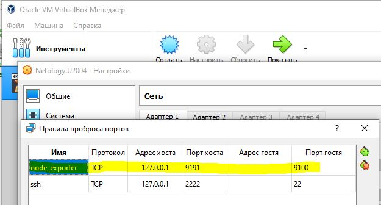
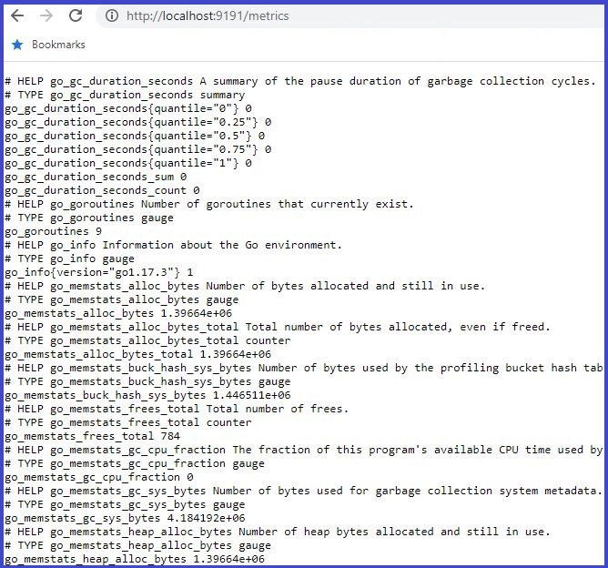
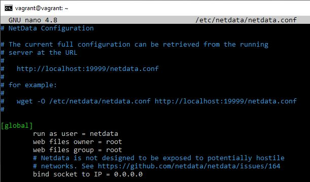
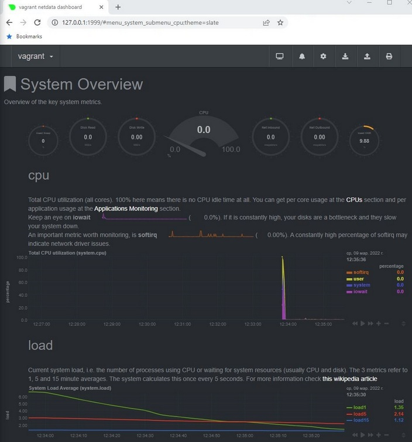

## Домашнее задание к занятию "3.4. Операционные системы, лекция 2"


__1. На лекции мы познакомились с [node_exporter](https://github.com/prometheus/node_exporter/releases). В демонстрации его исполняемый файл запускался в background.
Этого достаточно для демо, но не для настоящей production-системы, где процессы должны находиться под внешним управлением. Используя знания из лекции по `systemd`,
создайте самостоятельно простой [unit-файл](https://www.freedesktop.org/software/systemd/man/systemd.service.html) для `node_exporter`:__

- поместите его в автозагрузку,
- предусмотрите возможность добавления опций к запускаемому процессу через внешний файл (посмотрите, например, на `systemctl cat cron`),
- удостоверьтесь, что с помощью `systemctl` процесс корректно стартует, завершается, а после перезагрузки автоматически поднимается.__

=Выполнение=
----

[Пример](https://itdraft.ru/2020/11/02/ustanovka-node-exporter-s-avtorizacziej-i-podklyuchenie-k-prometheus-v-centos-8/)

Скачиваем node_exporter, причём нам нужна версия node_exporter-1.3.1.___linux___-amd64, иначе эта хрень не заработает:
```sh
vagrant@vagrant:~/tmp$ wget https://github.com/prometheus/node_exporter/releases/download/v1.3.1/node_exporter-1.3.1.linux-amd64.tar.gz
```
Распаковываем:
```sh
vagrant@vagrant:~/tmp$ tar -zxpvf node_exporter-1.3.1.linux-amd64
```
Копируем исполняемый файл в `/usr/local/bin`:
```sh
vagrant@vagrant:~$ sudo cp tmp/node_exporter-1.3.1.linux-amd64/node_exporter /usr/local/bin

```
Создаем systemd unit:
```sh
vagrant@vagrant:~$ sudo nano /etc/systemd/system/node_exporter.service

	[Unit]
	Description=Node Exporter
	
	[Service]
	ExecStart=/usr/local/bin/node_exporter
	EnvironmentFile=/etc/default/node_exporter
	
	[Install]
	WantedBy=multi-user.target
```
Добавляем сервис в автозагрузку, запускаем его, проверяем статус:
```sh
vagrant@vagrant:~$ sudo systemctl daemon-reload				# обновляем конфигурацию всех служб
vagrant@vagrant:~$ sudo systemctl enable --now node_exporter		# добавляем node_exporter в автозагрузку
Created symlink /etc/systemd/system/multi-user.target.wants/node_exporter.service → /etc/systemd/system/node_exporter.service.

vagrant@vagrant:~$ sudo systemctl status node_exporter
● node_exporter.service - Node Exporter
     Loaded: loaded (/etc/systemd/system/node_exporter.service; enabled; vendor preset: enabled)
     Active: active (running) since Mon 2022-03-07 15:50:19 UTC; 8s ago
   Main PID: 17336 (node_exporter)
      Tasks: 4 (limit: 2320)
     Memory: 2.3M
     CGroup: /system.slice/node_exporter.service
             └─17336 /usr/local/bin/node_exporter

Mar 07 15:50:19 vagrant node_exporter[17336]: ts=2022-03-07T15:50:19.842Z caller=node_exporter.go:115 level=info collector=thermal_zone
Mar 07 15:50:19 vagrant node_exporter[17336]: ts=2022-03-07T15:50:19.842Z caller=node_exporter.go:115 level=info collector=time
Mar 07 15:50:19 vagrant node_exporter[17336]: ts=2022-03-07T15:50:19.842Z caller=node_exporter.go:115 level=info collector=timex
Mar 07 15:50:19 vagrant node_exporter[17336]: ts=2022-03-07T15:50:19.842Z caller=node_exporter.go:115 level=info collector=udp_queues
Mar 07 15:50:19 vagrant node_exporter[17336]: ts=2022-03-07T15:50:19.842Z caller=node_exporter.go:115 level=info collector=uname
Mar 07 15:50:19 vagrant node_exporter[17336]: ts=2022-03-07T15:50:19.842Z caller=node_exporter.go:115 level=info collector=vmstat
Mar 07 15:50:19 vagrant node_exporter[17336]: ts=2022-03-07T15:50:19.842Z caller=node_exporter.go:115 level=info collector=xfs
Mar 07 15:50:19 vagrant node_exporter[17336]: ts=2022-03-07T15:50:19.842Z caller=node_exporter.go:115 level=info collector=zfs
Mar 07 15:50:19 vagrant node_exporter[17336]: ts=2022-03-07T15:50:19.843Z caller=node_exporter.go:199 level=info msg="Listening on" address=:9100
Mar 07 15:50:19 vagrant node_exporter[17336]: ts=2022-03-07T15:50:19.844Z caller=tls_config.go:195 level=info msg="TLS is disabled." http2=false
```
Из лога видим,  что сервис `node_exporter` ожидает подключений на порту 9100.
Проверяем порт 9100:
```sh
vagrant@vagrant:~$ sudo ss -pnltu | grep 9100
tcp     LISTEN   0        4096                    *:9100                *:*      users:(("node_exporter",pid=17336,fd=3))
```
Пробрасываем порт 9100 с ВМ на хост в наcтройках VirtualBox:




Подключаемся с хоста и проверяем:



На самой виртуальной машине это можно сделать с помощью команды:
```sh
vagrant@vagrant:~$ curl -s http://localhost:9100/metrics
```

Удостоверился, что процесс корректно стартует, завершается, а после перезагрузки автоматически поднимается.

=Выполнено=
----


__2. Ознакомьтесь с опциями `node_exporter` и выводом `/metrics` по-умолчанию. Приведите несколько опций, которые вы бы выбрали для базового мониторинга хоста по CPU, памяти, диску и сети.__

=Выполнение=
----

Наиболее подходящие на мой взгляд метрики:

```sh
[CPU]
node_cpu_seconds_total{cpu="1",mode="system"} 9.51
node_cpu_seconds_total{cpu="1",mode="user"} 2.31
node_cpu_seconds_total{cpu="0",mode="idle"} 15921.68

[Memory]
node_memory_MemAvailable_bytes 1.790394368e+09
node_memory_MemFree_bytes 1.530048512e+09

[Network]
node_network_receive_bytes_total{device="eth0"} 54586
node_network_receive_packets_total{device="eth0"} 318
node_network_receive_drop_total{device="eth0"} 0
node_network_receive_errs_total{device="eth0"} 0

node_network_transmit_bytes_total{device="eth0"} 40107
node_network_transmit_packets_total{device="eth0"} 235
node_network_transmit_drop_total{device="eth0"} 0
node_network_transmit_errs_total{device="eth0"} 0

[Disk]
node_disk_io_time_seconds_total{device="sda"} 21.836000000000002
node_disk_read_bytes_total{device="sda"} 2.89396736e+08
node_disk_read_time_seconds_total{device="sda"} 50.045
node_disk_write_time_seconds_total{device="sda"} 13.19
```
=Выполнено=
----


__3. Установите в свою виртуальную машину [Netdata](https://github.com/netdata/netdata). Воспользуйтесь [готовыми пакетами](https://packagecloud.io/netdata/netdata/install) для установки (`sudo apt install -y netdata`).__\
	После успешной установки:

- в конфигурационном файле `/etc/netdata/netdata.conf` в секции `[web]` замените значение с `localhost` на `bind to = 0.0.0.0`,
- добавьте в Vagrantfile проброс порта Netdata на свой локальный компьютер и сделайте `vagrant reload`:
```sh
config.vm.network "forwarded_port", guest: 19999, host: 19999
```
После успешной перезагрузки в браузере *на своем ПК* (не в виртуальной машине) вы должны суметь зайти на `localhost:19999`.
Ознакомьтесь с метриками, которые по умолчанию собираются Netdata и с комментариями, которые даны к этим метрикам.

=Выполнение=
----
Начнём с того, что в файле `/etc/netdata/netdata.conf` отсутствует секция `[web]`. Смотрим:


___"Нас это огорчит, но не остановит" (с)___

Меняем `bind socket to IP = 0.0.0.0` в секции `[global]` согласно заданию.\
Перезапускаем виртуалку и проверяем доступность Netdata с хоста.

Важный момент: порты на виртуальной машине и на хосте надо указывать __разные__, иначе ничего не получится.\
Т.о. в vagrantfile проброс порта Netdata будет выглядеть так:
```sh
config.vm.network "forwarded_port", guest: 19999, host: 1999
```



=Выполнено=
----


__4. Можно ли по выводу `dmesg` понять, осознает ли ОС, что загружена не на настоящем оборудовании, а на системе виртуализации?__

=Выполнение=
----
Начнём с базового определения:
>Осознание является формой психической активности и элементом высшей нервной деятельности, основой которой является головной мозг.

Таким образом, виртуальная машина __не__ способна что-либо осознавать в принципе.\
Более того, на текущий момент человечество не смогло создать полноценного разума, способного себя осознать.\
__По этой причине, вопрос абсолютно не корректен.__

Однако, если __человек__ посмотрит на вывод `dmesg`, то __человеку станет понятно__, что эта ОС выполняется в виртуальной среде и это знание __человек__ сможет как-то использовать.
```sh
vagrant@vagrant:~$ dmesg -T | grep virtual
[Mon Mar  7 19:11:15 2022] CPU MTRRs all blank - virtualized system.
[Mon Mar  7 19:11:15 2022] Booting paravirtualized kernel on KVM
[Mon Mar  7 19:11:29 2022] systemd[1]: Detected virtualization oracle.
```
=Выполнено=
----


__5. Как настроен `sysctl` `fs.nr_open` на системе по-умолчанию? Узнайте, что означает этот параметр. Какой другой существующий лимит не позволит достичь такого числа (`ulimit --help`)?__

=Выполнение=
----
Параметр `nr_open` - максимальный лимит пользователя на открытые дескрипторы ядра.

Значение `nr_open`:
```sh
vagrant@vagrant:~$ sudo sysctl -a | grep nr_open
fs.nr_open = 1048576
```

Параметр `file-max` - максимальное значение дескрипторов этой версии ОС.

Значение `file-max`:
```sh
vagrant@vagrant:~$ sudo sysctl -a | grep file-max
fs.file-max = 9223372036854775807
```

Далее, soft-лимит на файловые дескрипторы пользователя:
```sh
vagrant@vagrant:~$ ulimit -Sn
1024
```
Он может быть увеличен для пользователя в процессе работы, но не более значения `fs.nr_open = 1048576`.

А вот hard-лимит на файловые дескрипторы пользователя:
```sh
vagrant@vagrant:~$ ulimit -Hn
1048576
```
Это значение не может быть больше `nr_open`, а значит его можно только уменьшать для пользователя.


=Выполнено=
----

__6. Запустите любой долгоживущий процесс (не `ls`, который отработает мгновенно, а, например, `sleep 1h`) в отдельном неймспейсе процессов;
	покажите, что ваш процесс работает под `PID 1` через `nsenter`. Для простоты работайте в данном задании под *root* (`sudo -i`).\
	Под обычным пользователем требуются дополнительные опции (`--map-root-user`) и т.д.__

=Выполнение=
----

Делаем новый NS по PID и запускаем в нём `sleep` на час.

```sh
root@vagrant:~# unshare -f --pid --mount-proc sleep 1h &
[1] 1762
```
Проверяем, что получилось и как это выглядит "снаружи".
```sh
vagrant@vagrant:~$ ps -efH
....
vagrant     1532    1531  0 14:02 pts/1    00:00:00     -bash
root        1558    1532  0 14:03 pts/1    00:00:00       sudo -i
root        1559    1558  0 14:03 pts/1    00:00:00         -bash
root        1762    1559  0 14:40 pts/1    00:00:00           unshare -f --pid --mount-proc sleep 1h
root        1763    1762  0 14:40 pts/1    00:00:00             sleep 1h
vagrant     1542    1531  0 14:02 pts/2    00:00:00     -bash
vagrant     1769    1542  0 14:41 pts/2    00:00:00       ps -efH
```
Заходим в нужный NS:
```sh
root@vagrant:~# nsenter --target 1762 --pid --mount
root@vagrant:/# pstree -p
sleep(1)
root@vagrant:/#
```
Видим, что наш процесс `sleep` имеет PID=1 в созданном NS.\
При этом для ОС этот процесс имеет PID = 1762.

=Выполнено=
----

__7. Найдите информацию о том, что такое `:(){ :|:& };:`.\
	Запустите эту команду в своей виртуальной машине Vagrant с Ubuntu 20.04 (*это важно, поведение в других ОС не проверялось*).\
	Некоторое время все будет "плохо", после чего (минуты) – ОС должна стабилизироваться.\
	Вызов `dmesg` расскажет, какой механизм помог автоматической стабилизации.\
	Как настроен этот механизм по-умолчанию, и как изменить число процессов, которое можно создать в сессии?__

=Выполнение=
----
Начнём с простого. Известная нам команда `ulimit` позволяет регулировать число процессов в сессии пользователя.\
Например, `ulimit -n 15` - ограничит число процессов пользователя до 15.

Теперь про эту странную команду. Частями:

`:` - пустая команда, которая ничего не делает, о чём сообщает нам вывод `help :`;\
`()` - оператор позволяет выполнить команду в порядке приоритета;\
`{}` - объединение двух или более команд, каждая следующая команда зависит от выполнения предыдущей;\
`|` - оператор потока PIPE, выходные данные первой команды действуют как входные данные для второй команды;\
`;` - оператор позволяет запускать несколько команд за один раз, выполнение команд происходит последовательно;\
`&` - запуск команды в фоновом режиме.

Что это значит в комплексе?\
`ничего_не_делать(пусто, поэтому тоже ничего не делать){ничего_не_делать | ничего_не_делать в фоне} ; ничего_не_делать`.
Бред какой-то. Скрипты я пока не знаю и разобраться с этим самостоятельно не могу.

Объяснение ниже, мне ни о чём не говорит:
>`:(){ :|:& };:` - *логическая бомба (известная также как fork bomb), забивающая память системы, что в итоге приводит к её зависанию.
>Чтобы лучше понять, как она действует, давайте её немного преобразуем:

```sh
fu() {
  fu | fu &
}
fu
```
>Этот Bash код создаёт функцию, которая запускает ещё два своих экземпляра, которые, в свою очередь снова запускают эту функцию и так до тех пор, пока этот процесс не займёт всю >физическую память компьютера, и он просто не зависнет. Ни к чему фатальному это конечно не приведет, но перезагрузиться всё же придётся.

Ну да, после запуска этой команды начался бесконечный: `-bash: fork: Resource temporarily unavailable`\
Виртуалка зависла примерно на 10 минут наглухо. Потом ожила.

Изменил `ulimit -n 10` и запустил эту хрень снова. Примерно через 2 минуты машина снова ожила.

```sh
vagrant@vagrant:~$ ulimit -u 10
vagrant@vagrant:~$ :(){ :|:& };:
[1] 135019
vagrant@vagrant:~$ -bash: fork: retry: Resource temporarily unavailable
-bash: fork: retry: Resource temporarily unavailable
....
-bash: fork: Resource temporarily unavailable
-bash: fork: Resource temporarily unavailable
^C
[1]+  Done                    : | :
vagrant@vagrant:~$
```

Смотрим в логе dmesg выделенное красным:
```
[Thu Mar 10 09:37:37 2022] rcu: INFO: rcu_sched self-detected stall on CPU
[Thu Mar 10 09:37:37 2022] watchdog: BUG: soft lockup - CPU#1 stuck for 90s! [swapper/1:0]
[Thu Mar 10 09:37:37 2022] rcu:         0-...!: (1 ticks this GP) idle=382/0/0x1 softirq=735025/735025 fqs=0
[Thu Mar 10 09:37:37 2022] Modules linked in: cfg80211 nfnetlink vboxsf(OE) dm_multipath scsi_dh_rdac scsi_dh_emc scsi_dh_alua input_leds vboxguest(OE) mac_hid serio_raw sch_fq_codel msr ip_tables x_tables autofs4 btrfs zstd_compress raid10 raid456 async_raid6_recov async_memcpy async_pq async_xor async_tx xor raid6_pq libcrc32c raid1 raid0 multipath linear vboxvideo(OE) ttm psmouse ahci libahci drm_kms_helper syscopyarea sysfillrect sysimgblt fb_sys_fops drm e1000 i2c_piix4 pata_acpi video
[Thu Mar 10 09:37:37 2022]      (t=24339 jiffies g=1285669 q=2742)
[Thu Mar 10 09:37:37 2022] CPU: 1 PID: 0 Comm: swapper/1 Tainted: G           OE     5.4.0-91-generic #102-Ubuntu
[Thu Mar 10 09:37:37 2022] rcu: rcu_sched kthread starved for 24339 jiffies! g1285669 f0x0 RCU_GP_WAIT_FQS(5) ->state=0x402 ->cpu=0
[Thu Mar 10 09:37:37 2022] rcu: RCU grace-period kthread stack dump:
[Thu Mar 10 09:37:37 2022] Hardware name: innotek GmbH VirtualBox/VirtualBox, BIOS VirtualBox 12/01/2006
[Thu Mar 10 09:37:37 2022] rcu_sched       I    0    10      2 0x80004000
```
Нашёл описание всего этого в `stallwarn`: https://www.kernel.org/doc/Documentation/RCU/stallwarn.txt

Приводить цитаты оттуда не буду - слишком много, муторно и малопонятно. Точнее вообще непонятно.

Должен вам сказать, что по этой теме надо отдельно лекцию читать, объяснять, а не вот это вот всё, когда понимания всё равно почти нет.

=Выполнено=
----


#### Примечания

Про unit-файлы:
- [__systemd: основные приемы работы с юнит-файлами__](http://rus-linux.net/MyLDP/boot/systemd_2_getting_a_grip_on_units.html)
- [__systemd Часть 1: Понимание systemd, типы юнитов и целевые юниты__](https://max-ko.ru/9-systemd-i-junity.html)
- [__systemd Часть 2: Управление юнитами, зависимостями и целями__](https://max-ko.ru/10-systemd-chast-2-upravlenie-junitami-zavisimostjami-i-celjami.html)

[__Установка и настройка Prometheus__](https://losst.ru/ustanovka-i-nastrojka-prometheus)
[__Осваиваем мониторинг с Prometheus. Часть 1. Знакомство и установка__](https://laurvas.ru/prometheus-p1/#node-exporter-installation)

[__Проброс портов в VirtualBox__](https://losst.ru/probros-portov-virtualbox)
[__Настройка сети VirtualBox__](https://help.reg.ru/hc/ru/articles/4408054736529-%D0%9D%D0%B0%D1%81%D1%82%D1%80%D0%BE%D0%B9%D0%BA%D0%B0-%D1%81%D0%B5%D1%82%D0%B8-VirtualBox)


