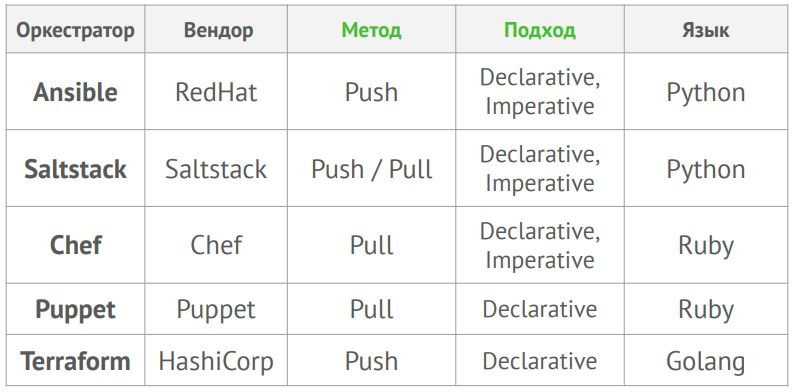

Апрель 2022
# Понятие IaaC - Infrastructure as a Code

## Infrastructure as a Code

Подход «*Инфраструктура как код (IaaC)*», который иногда называют «программируемой инфраструктурой», — это паттерн, по которому процесс создания/настройки
инфраструктуры аналогичен процессу разработки программного обеспечения.

> Па́ттерн (англ. pattern) — схема, действующая, как эффективный способ решения характерных задач проектирования, в частности проектирования компьютерных программ.

По сути, этот __паттерн__ положил начало устранению границ между написанием приложений и созданием сред для выполнения этих приложений.

Это основа облачных вычислений и неотъемлемая часть DevOps-методологии.

__Основные преимущества IaaC:__

- __Ускорение производства и вывода продукта на рынок.__\
Автоматизация IaaC значительно ускоряет процесс предоставления инфраструктуры для разработки, тестирования и масштабирования по мере необходимости.

> Простой пример: необходимо увеличить количество одинаково настроенных ВМ в несколько раз.\
> Делать это вручную дольше, чем в автоматическом режиме и не гарантирует того, что все ВМ буду настроены точно одинаково.

- __Стабильность среды, устранение дрейфа конфигураций.__\
Дрейф конфигурации происходит, когда произвольные изменения и обновления конфигурации приводят к несовпадению сред разработки, тестирования и развёртывания.

- __Более быстрая и эффективная разработка.__ Упрощая предоставление инфраструктуры и повышая её консистентность, IaaC ускоряет каждый этап жизненного
цикла доставки ПО. Разработчики могут быстро подготовить «песочницы» и среды непрерывной интеграции/непрерывного развёртывания (`CI/CD`). Быстрее 
предоставляются тестовые среды, инфраструктура для проверки безопасности и юзабилити.

__Главное преимущество применения IaaC__

> Идемпоте́нтность (лат. idem — тот же самый + potens — способный) — это свойство объекта или операции, при повторном выполнении которой мы получаем
результат идентичный предыдущему и всем последующим выполнениям.

*Этот термин предложил американский математик Бенджамин Пирс в статьях 1870-х годов.*

## Подходы к применению IaaC-паттернов

Существует 3 подхода:
- __Декларативный__. “Что” мы делаем? Т.е., как должна выглядеть целевая конфигурация\инфраструктура. Это конфиги сервера.

- __Императивный__. “Как” мы это делаем? Т.е. какие изменения мы должны внести, чтобы получилось нужное. Обновления сервисов и конфигов. 

- __Интеллектуальный__. “Почему” мы это делаем? Т.е. почему инфраструктура должна быть именно такой. Это документация по проекту. И тут надо подойти
максимально скурпулёзно к созданию этой документации, выяснив досконально необходимые аппаратные ресурсы, ограничения той или иной технологии,
применяемой для нашей инфраструктуры, прописать временные рамки внедрения или внесеня изменений, развития через пол года, год и т.д.
Вобщем, со всех возможных ракурсов защитив себя от возможных проблем в будущем.

## Методы IaaC

Существует 3 метода применения IaаC:
- __Push__. В этом режиме конфигурация серверу отправляется управляющим сервером.
- __Pull__. В этом режиме целевой хост сам инициирует получение своей конфигурации, потому что на нём установлен агент, запрашивающий у master-сервера новую конфигурацию для своего хоста.
- __Гибридный__ (сочетает оба метода). Используется при построении сложных многокомпонентных систем и целого набора инструментов управления конфигурациями.

Разница в том, *кто именно* инициирует изменение в конфигурации целевого хоста.

## Сравнение популярных IaaC инструментов

Рассмотрим, по какой модели работает каждый из них:


> Кстати, говорят, что `Ancible`, `Saltstack` и `Puppet` имеют модули для работы с Windows Server!

## Паттерны IaaC

__Паттерн 1. CI или Continuous Integration__ 

__Непрерывная интеграция (CI)__ — практика разработки ПО, которая заключается в постоянном слиянии рабочих веток в общую основную ветку разработки,
и выполнении частых автоматизированных сборок проекта.

Непрерывная интеграция позволяет снизить трудозатраты на выполнение рутинных задач команд разработки и сделать её более предсказуемой за счёт раннего
обнаружения и устранения ошибок и противоречий.

Основным преимуществом данного паттерна является сокращение стоимости исправления дефекта, за счёт его раннего выявления.

Здесь лектор привёл довольно простою и наглядную аналогию: 
	
	Если при строительстве дома ошиблись с расчётами фундамента, то исправить это дешевле тут же, при закладке фундамента, чем потом, когда при монтаже крыши фундамент треснет от нагрузки.

Так же, по сути, всё работает и в случае разработки ПО. Чем раньше обнаружили ошибку за счёт того, что все проверки кода проходят автоматически после
коммитов в репозиторий, происходит серьёзная экономия времени, а значит и денег. Ведь ошибки, как правило, достаточно однотипны  и существует достаточное
количество инструментов позволяющих их выявлять на этапе сборки проекта. Сами разработчики и исправляют эти ошибки, прогоняя автотесты.

*Получается, что на этом этапе в репозитории собирается готовый проект нашего ПО.*

__Паттерн 2. CD или Continuous Delivery__ 

__Непрерывная доставка (CD) — CI + CD__.\
Это следующий после `CI` уровень.

Теперь новая версия не только создаётся и тестируется при каждом изменении кода, регистрируемом в репозитории, но и может быть оперативно запущена по
одному нажатию кнопки развёртывания.

Позволяет выпускать изменения небольшими партиями, которые легко изменить или устранить, путём отката на предыдущую версию и последующего перезапуска
процесса сборки с учётом исправления выявленных дефектов. Однако запуск развёртывания всё ещё происходит вручную — ту самую кнопку всё же надо кому-то нажать.

*На этом этапе можно настроить __автоматическую доставку__ нашего ПО из репозитория в среду выполнения: на тестовый стенд, стенд внедрения и т.д.
Но тут важно понимать, что хоть доставка из репозитория и происходит, но разворачиваться/деплоиться ПО будет __НЕ__ автоматически, а после запуска этой процедуры вручную*

О том, как безопасно деплоить будет рассказано в одной из следующих лекций.

__Паттерн 3. CD или Continuous Deployment__

*Это самый редко используемый паттерн*

__Непрерывное развёртывание (CD) — CI + CD + СD__.

После автоматизации релиза остаётся один ручной этап: одобрение т.е. запуск в production - это всё та же кнопка, которую кто-то должен нажать!
> И именно этот этап решает вопрос нажатия кнопки :)

Практика непрерывного развёртывания __упраздняет все ручные действия__, не требуя непосредственного утверждения со стороны разработчика или любого другого
ответственного лица.

Все изменения развёртываются автоматически. Обычно такая практика используется для стендов тестировая и бета-пользователей, но в рroduction по прежнему
релизы происходят в ручную по причине высокого риска для бизнеса.

----

## Резюмируя паттерны: CI + CD + CD
- CI (Continuous Integration) – Непрерывная интеграция
- CD (Continuous Delivery) – Непрерывная доставка
- CD (Continuous Deployment) – Непрерывное развёртывание

__Важно!__
> Как правило, под термином `CI/CD` подразумеваются только первые два термина: __интеграция и доставка__. 

Непрерывная доставка __Continuous Delivery__ отличается от непрерывного развертывания __Continuous Deployment__ тем, что процесс развертывания, deployment,
в производственную среду, production, должен быть подтвержден вручную.

----

*Канареечный деплой - это когда новая версия тестируется на минимальном количестве пользователей. В случае успеха накатывается на всех пользователей, а в
случае неудачи возвращается старая версия.*

*Blue-Green deploy - это два production, перед которыми стоит балансировщик, позволяющий перенаправить какой-то процент пользователей на новую версию,
сохранив при этом полностью работоспособной старую.*

## Инструменты IaaC.

### Vagrant

Vagrant — это инструмент для создания и управления ВМ посредством использования принципов IaaC. Vagrant сокращает время настройки среды разработки и делает
оправдание разработчиков «на моём компьютере всё работает» пережитком прошлого.

Преимущества:
- Скорость – быстрый старт виртуального окружения;
- Простота – декларативный метод описания конфигураций;
- Расширяемость — лёгкое подключение кастомных провайдеров.

#### Провайдеры Vagrant

Провайдеры из коробки:
- VirtualBox;
- Hyper-V;
- Docker.

Прежде чем вы сможете использовать другого провайдера, вы должны установить его. Установка провайдеров осуществляется через систему плагинов Vagrant.

Пример с VMWare:
```sh
# Установка провайдера VMWare с помощью системы плагинов
$ vagrant plugin install vagrant-vmware-desktop

# Обновление провайдера VMWare с помощью системы плагинов
$ vagrant plugin update vagrant-vmware-desktop
```

Первые шаги:
```sh
# Проверяем установленную версию
$ vagrant --version
Vagrant 2.2.9

# Задаём провайдер по умолчанию
$ export VAGRANT_DEFAULT_PROVIDER=virtualbox

# Загружаем образ ВМ hashicorp/bionic64 для провайдера virtualbox
$ vagrant box add bento/ubuntu-20.04 --provider=virtualbox --force
==> box: Loading metadata for box 'bento/ubuntu-20.04'
 box: URL: https://vagrantcloud.com/bento/ubuntu-20.04
==> box: Adding box 'bento/ubuntu-20.04' (v202107.28.0) for provider:
virtualbox
 box: Downloading:
https://vagrantcloud.com/bento/boxes/ubuntu-20.04/versions/202107.28.0/
providers/virtualbox.box
Download redirected to host:
vagrantcloud-files-production.s3-accelerate.amazonaws.com
==> box: Successfully added box 'bento/ubuntu-20.04' (v202107.28.0) for
'virtualbox'!
# Проверяем доступные нам образы операционных систем
$ vagrant box list
bento/ubuntu-16.04 (virtualbox, 201802.02.0)
debian/stretch64 (virtualbox, 9.4.0)
bento/ubuntu-20.04
```

#### Структура Vagrantfile: часть 1

```sh
ISO = "bento/ubuntu-20.04"
NET = "192.168.192."
DOMAIN = ".netology"
HOST_PREFIX = "server"
INVENTORY_PATH = "../ansible/inventory"
servers = [
 {
 :hostname => HOST_PREFIX + "1" + DOMAIN,
 :ip => NET + "11",
 :ssh_host => "20011",
 :ssh_vm => "22",
 :ram => 1024,
 :core => 1
 }
]
```

#### Структура Vagrantfile: часть 2

```sh
Vagrant.configure(2) do |config|
 config.vm.synced_folder ".", "/vagrant", disabled: false
 servers.each do |machine|
 config.vm.define machine[:hostname] do |node|
 node.vm.box = ISO
 node.vm.hostname = machine[:hostname]
 node.vm.network "private_network", ip: machine[:ip]
 node.vm.network :forwarded_port, guest: machine[:ssh_vm],
host: machine[:ssh_host]
 node.vm.provider "virtualbox" do |vb|
 vb.customize ["modifyvm", :id, "--memory", machine[:ram]]
 vb.customize ["modifyvm", :id, "--cpus", machine[:core]]
 vb.name = machine[:hostname]
 end
 end
 end
end
```

## Инструменты IaaC. Ansible

__Ansible__ — это инструмент для управления конфигурациями.

Главное его отличие от других подобных систем в том, что Ansible использует существующую SSH инфраструктуру, в то время как другие (Saltstack, Chef, Puppet, и пр.)
требуют установки специального PKI-окружения.

Преимущества:
- Скорость – быстрый старт на текущей SSH инфраструктуре;
- Простота – декларативный метод описания конфигураций;
- Расширяемость — лёгкое подключение кастомных ролей и модулей.

__Ansible: жизненный цикл__

Ansible может применятся на всех стадиях жизненного цикла инфраструктуры ваших проектов:
- Provision
- Configure
- Deploy
- Operate

Ansible поставляется с огромным количеством готовых к использованию [__модулей__](https://docs.ansible.com/ansible/2.8/modules/list_of_all_modules.html).

```sh
# Вывод версии Ansible
$ ansible --version
ansible 2.9.11
 config file = /Users/olegbukatchuk/git/netology.ru/virt-homeworks/05-virt-02-iaac/src/ansible/ansible.cfg
 configured module search path = ['/Users/olegbukatchuk/.ansible/plugins/modules',
'/usr/share/ansible/plugins/modules']
 ansible python module location = /usr/local/Cellar/ansible/2.9.11/libexec/lib/python3.8/site-packages/ansible
 executable location = /usr/local/bin/ansible
 python version = 3.8.5 (default, Jul 31 2020, 14:19:14) [Clang 11.0.3 (clang-1103.0.32.62)]
# С этого момента команда ниже это ваш лучший друг, не считая google.com :-)
$ ansible -h
```
__Ansible: playbook__ (подготовка)

Определим inventory файл для Ansible playbook в котором содержится информация о ВМ:
```sh
[nodes:children]
manager
[manager]
server1.netology ansible_host=127.0.0.1 ansible_port=20011 ansible_user=vagrant
```

Определим файл `ansible.cfg` для Ansible, который содержит настройки по умолчанию для Ansible:
```sh
[defaults]
inventory=./inventory
deprecation_warnings=False
command_warnings=False
ansible_port=22
interpreter_python=/usr/bin/python3
```

Напишем небольшой Ansible playbook который будет устанавливать Docker в создаваемую нами ВМ сразу после её создания:
```sh
---
 — hosts: nodes
 become: yes
 become_user: root
 remote_user: vagrant
 tasks:
 — name: Create directory for ssh-keys
 file: state=directory mode=0700 dest=/root/.ssh/
 — name: Adding rsa-key in /root/.ssh/authorized_keys
 copy: src=~/.ssh/id_rsa.pub dest=/root/.ssh/authorized_keys owner=root
mode=0600
 ignore_errors: yes
 — name: Checking DNS
 command: host -t A google.com
 — name: Installing tools
 apt: >
 package={{ item }}
 state=present
 update_cache=yes
 with_items:
 — git
 — curl
 — name: Installing docker
 shell: curl -fsSL get.docker.com -o get-docker.sh && chmod +x
get-docker.sh && ./get-docker.sh
 — name: Add the current user to docker group
 user: name=vagrant append=yes groups=docker
```

__Ansible: provision__

Подключаем Ansible playbook к нашей Vagrant конфигурации:
```sh
INVENTORY_PATH = "../ansible/inventory"
node.vm.provision "ansible" do |setup|
 setup.inventory_path = INVENTORY_PATH
 setup.playbook = "../ansible/provision.yml"
 setup.become = true
 setup.extra_vars = { ansible_user: 'vagrant' }
end
```


